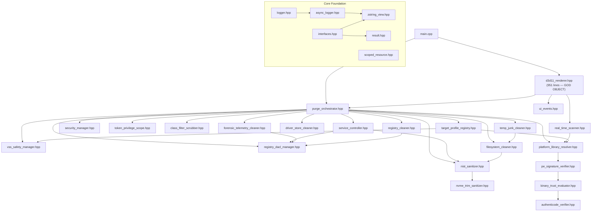

# 🔬 VORTEX CLEANER — DEEP CODE AUDIT REPORT
### Principal Systems Architecture & Engineering Review
**Date:** 2026-10-01  
**Scope:** 27 source files | ~5,200 lines of code | Full line-by-line analysis  
**Auditor Level:** Principal Systems Architect — Hyper-Critical  
**Build Status at Audit Time:** ✅ `0 errors, 0 warnings` under `/WX`

---

## 📊 EXECUTIVE SUMMARY

| Severity | Count |
|----------|-------|
| 🔴 CRITICAL | 6 |
| 🟠 HIGH | 14 |
| 🟡 MEDIUM | 18 |
| 🔵 LOW | 12 |
| **TOTAL** | **50** |

---

## 📐 ARCHITECTURAL DEPENDENCY MAP



---

## 🔴 CRITICAL FINDINGS (6)

### VTX-AUDIT-001: `d3d11_renderer.hpp` — Duplicate Type Definitions Causing ODR Violation Risk
**File:** `d3d11_renderer.hpp` L24-37 & `luxury_window_presenter.hpp` L13-26  
**Severity:** 🔴 CRITICAL

`ViewState` enum and `UIRect` struct are **defined identically in TWO separate files** inside the SAME namespace `WinTracePurge::Gui`. While this compiles today because they are in separate translation units (header-only), any future `.cpp` file that includes both will cause an **ODR (One Definition Rule) violation** — undefined behavior per the C++ standard.

```
d3d11_renderer.hpp:24      enum class ViewState { Dashboard, Scanning, ... }
luxury_window_presenter.hpp:13  enum class ViewState { Dashboard, Scanning, ... }
```

**Fix:** Extract `ViewState` and `UIRect` into a single shared header (e.g., `gui/gui_types.hpp`) and include it from both files.

---

### VTX-AUDIT-002: Thread-Safety Violations in `d3d11_renderer.hpp` Shared State
**File:** `d3d11_renderer.hpp` L41-55  
**Severity:** 🔴 CRITICAL

Multiple `inline static` members are **read from the UI thread and written from worker threads** without synchronization:

| Variable | Written From | Read From | Protected? |
|----------|-------------|-----------|------------|
| `s_CurrentState` | Worker thread (L693, L726) + UI thread (L819, L843, L913, L923, L930) | UI thread (WM_PAINT, WM_TIMER, WM_LBUTTONDOWN) | ❌ **NO** |
| `s_LiveScanDetail` | Worker thread (L708, L750) | UI thread (L682) | ❌ **NO** |
| `s_CurrentScanReport` | Worker thread (via PostMessage L816) + Worker direct write | UI thread (rendering) | ❌ **PARTIAL** |
| `s_AnimAngle` | UI thread (WM_TIMER L886) | UI thread (rendering) | ✅ Same thread |
| `s_HoveredBtn` | UI thread only | UI thread only | ✅ Same thread |
| `s_HasScannedOnce` / `s_HasPurgedOnce` | Worker thread (PostMessage handler) | UI thread (rendering) | ❌ **NO** |

The `PostMessage`-based transfer was correctly added for scan/purge results, but `s_CurrentState` is still directly mutated from both `StartLiveScan()` (which runs on UI thread) AND from cancel/back button handlers. The **real danger** is that `StartLiveScan` sets `s_CurrentState = Scanning` on L693 while a detached thread may also trigger state changes via `PostMessageW`, creating a TOCTOU window.

**Fix:** Make `s_CurrentState` an `std::atomic<ViewState>`, and move ALL state mutations to the UI thread via message handlers.

---

### VTX-AUDIT-003: `registry_dacl_manager.hpp` — SID Memory Leak on Error Path
**File:** `registry_dacl_manager.hpp` L31-92  
**Severity:** 🔴 CRITICAL

If `SetNamedSecurityInfoW` on L43 fails (L51-53), execution continues to L68 (`AllocateAndInitializeSid` for SYSTEM SID). However, if `SetEntriesInAclW` on L77 fails, `pAdminSid` and `pSystemSid` are freed but `pNewDacl` may not be freed (it remains `NULL` on failure). More critically:

**Line 68:** `AllocateAndInitializeSid` for `pSystemSid` — the return value is **not checked**. If it fails, `pSystemSid` is `NULL` and `ea[1].Trustee.ptstrName` is `reinterpret_cast<LPWSTR>(NULL)` — **undefined behavior** when `SetEntriesInAclW` processes it.

```cpp
::AllocateAndInitializeSid(&ntAuthority, 1, SECURITY_LOCAL_SYSTEM_RID, 0, 0, 0, 0, 0, 0, 0, &pSystemSid);
// ↑ Return value IGNORED! pSystemSid could be NULL
ea[1].Trustee.ptstrName = reinterpret_cast<LPWSTR>(pSystemSid); // UB if NULL
```

**Fix:** Check `AllocateAndInitializeSid` return value and skip the SYSTEM ACE if it fails. Use RAII for SID allocations.

---

### VTX-AUDIT-004: `platform_library_resolver.hpp` — Raw `HKEY` Handle Leak in `GetSteamLibraryPaths()`
**File:** `platform_library_resolver.hpp` L52-58  
**Severity:** 🔴 CRITICAL

```cpp
HKEY hSteamKey;
if (::RegOpenKeyExW(HKEY_CURRENT_USER, L"Software\\Valve\\Steam", 0, KEY_READ, &hSteamKey) == ERROR_SUCCESS) {
    if (::RegQueryValueExW(hSteamKey, L"SteamPath", NULL, NULL, ...) == ERROR_SUCCESS) {
        libraries.push_back(fs::path(szSteamPath));
    }
    ::RegCloseKey(hSteamKey);  // L57 — Only reached on SUCCESS path
}
```

This specific code IS correct (close is inside the if-block), but it uses a **raw `HKEY`** instead of `Core::ScopedHKey`. If any future modification adds an early return between L53-L57, it will leak. This is the only file that uses raw HKEY handles and it's inconsistent with the rest of the codebase.

**Fix:** Replace with `Core::ScopedHKey hSteamKey;` and use `hSteamKey.Put()` consistently.

---

### VTX-AUDIT-005: `target_profile_registry.hpp` — Data Typo: `bedisy.sys` instead of `bedrive.sys`
**File:** `target_profile_registry.hpp` L45, L71  
**Severity:** 🔴 CRITICAL (Data Integrity)

```cpp
config.DriverFilenames = {
    L"vgk.sys", L"easyanticheat.sys", L"easyanticheat_eos.sys", L"bedisy.sys"  // ← TYPO!
};
```

The filename `bedisy.sys` does **NOT EXIST**. The correct filename is `bedrive.sys`. This typo appears in BOTH `AntiCheatStandard` (L45) and `DeepForensicZeroTrace` (L71) profiles. The consequence is that **BattlEye driver files will never be matched** when using profiles from `CTargetProfileRegistry`.

Note: The hardcoded config in `d3d11_renderer.hpp::StartLivePurge()` (L763) correctly uses `bedrive.sys`, masking this bug in the GUI path.

---

### VTX-AUDIT-006: `nist_sanitizer.hpp` — Same Random Buffer Reused for Entire File Overwrite
**File:** `nist_sanitizer.hpp` L57-77  
**Severity:** 🔴 CRITICAL (Security)

```cpp
std::vector<BYTE> zeroBuffer(kSectorBuffer, 0);
::BCryptGenRandom(nullptr, zeroBuffer.data(), static_cast<ULONG>(kSectorBuffer), BCRYPT_USE_SYSTEM_PREFERRED_RNG);

while (bytesRemaining > 0) {
    // Same random buffer written repeatedly!
    BOOL success = ::WriteFile(hFile.Get(), zeroBuffer.data(), toWrite, &bytesWritten, nullptr);
```

The CSPRNG is called **only once** to fill a 64KB buffer, then that **same 64KB pattern is written across the entire file**. For a 1GB file, this means the same 64KB pattern repeats 16,384 times. A forensic recovery tool could detect the repeating pattern and reconstruct file structure boundaries.

**Fix:** Call `BCryptGenRandom()` inside the write loop for each chunk, or at minimum re-randomize every N iterations.

---

## 🟠 HIGH FINDINGS (14)

### VTX-AUDIT-007: `d3d11_renderer.hpp` — 951-Line God Object (Unresolved VTX-ARCH-001)
**File:** `d3d11_renderer.hpp`  
**Severity:** 🟠 HIGH (Architectural)

`CLuxuryWindowRenderer` is a **monolithic God Object** containing:
- Window creation (L89-130)
- 5 separate rendering methods (L133-632)
- Worker thread dispatch (L692-788)
- WindowProc message handler (L790-947)
- Static shared state management (L41-55)
- UI button layout definitions (L75-87)
- Score calculation algorithm (L58-72)

**SOLID Violation:** This class has at minimum **7 distinct responsibilities**. The `luxury_window_presenter.hpp` was created but is **never referenced or used** from `d3d11_renderer.hpp`. The presenter exists as dead code.

---

### VTX-AUDIT-008: `luxury_window_presenter.hpp` — Dead Code (Never Instantiated)
**File:** `luxury_window_presenter.hpp` L40-167  
**Severity:** 🟠 HIGH

`CLuxuryWindowPresenter` is **never instantiated** anywhere in the project. Neither `d3d11_renderer.hpp` nor `main.cpp` reference it. The `ILuxuryView` interface has zero implementations. This is 170 lines of dead code.

---

### VTX-AUDIT-009: `d3d11_renderer.hpp` — `LOWORD/HIWORD` Truncation on Multi-Monitor Coordinates
**File:** `d3d11_renderer.hpp` L849-850, L892-893  
**Severity:** 🟠 HIGH

```cpp
int px = LOWORD(lParam);
int py = HIWORD(lParam);
```

`LOWORD`/`HIWORD` extract unsigned 16-bit values. On multi-monitor setups, mouse coordinates can be **negative** (when windows span to left monitors). Using `LOWORD`/`HIWORD` instead of `GET_X_LPARAM`/`GET_Y_LPARAM` from `<windowsx.h>` produces incorrect coordinates.

**Fix:** `#include <windowsx.h>` and use `GET_X_LPARAM(lParam)` / `GET_Y_LPARAM(lParam)`.

---

### VTX-AUDIT-010: `async_logger.hpp` — Auto-Initialize Race Condition
**File:** `async_logger.hpp` L72-75  
**Severity:** 🟠 HIGH

```cpp
static void PostLog(...) noexcept {
    if (!s_Running.load(std::memory_order_relaxed)) {
        Initialize();  // Can be called from multiple threads simultaneously!
    }
```

If two threads call `PostLog()` simultaneously before initialization, both will enter `Initialize()`. While `Initialize()` has a mutex lock, the `s_Running` check is `memory_order_relaxed` — a thread may see a stale `false` even after another thread has set it to `true`. This creates a benign but wasteful double-initialization attempt.

**Fix:** Use `std::call_once` or check `s_Running` with `memory_order_acquire` after acquiring `s_InitMutex`.

---

### VTX-AUDIT-011: `service_controller.hpp` — Recursive Dependent Service Purge May Delete Unrelated Services
**File:** `service_controller.hpp` L239-258  
**Severity:** 🟠 HIGH

`StopDependentServices` calls `StopAndPurgeService` recursively for each dependent. `StopAndPurgeService` performs a **full teardown** including registry deletion and binary sanitization. This means if a target service has dependencies that are **shared with legitimate services**, those legitimate services will be permanently destroyed.

Example: If `BEService` has a shared dependency with another legitimate service, that dependency gets its registry key wiped and binary NIST-shredded.

---

### VTX-AUDIT-012: `real_time_scanner.hpp` — Raw `SC_HANDLE` Leak
**File:** `real_time_scanner.hpp` L77, L123  
**Severity:** 🟠 HIGH

```cpp
SC_HANDLE hSCM = ::OpenSCManagerW(NULL, NULL, SC_MANAGER_CONNECT | SC_MANAGER_ENUMERATE_SERVICE);
// ...
if (hSCM) ::CloseServiceHandle(hSCM);  // L123 - manual cleanup
```

Uses raw `SC_HANDLE` instead of `Core::ScopedSCMHandle`. If an exception occurs (unlikely in this code but possible from `std::format`), the handle leaks. Inconsistent with the rest of the codebase.

---

### VTX-AUDIT-013: `real_time_scanner.hpp` — Raw `HKEY` Handles (Multiple)
**File:** `real_time_scanner.hpp` L88-100, L129-134, L153-159  
**Severity:** 🟠 HIGH

Three separate functions use raw `HKEY` handles with manual `RegCloseKey` calls. Inconsistent with every other module that uses `Core::ScopedHKey`.

---

### VTX-AUDIT-014: `security_manager.hpp` — Persistent Privilege Scope via `static` Local
**File:** `security_manager.hpp` L50-57  
**Severity:** 🟠 HIGH

```cpp
static Core::Result<bool> EnableAllRequiredPrivileges() {
    auto scopeRes = TokenPrivilegeScope::AcquireAllRequired();
    static auto s_persistentScope = std::move(*scopeRes);  // ← Never destroyed!
    return true;
}
```

`s_persistentScope` is a function-local `static` that **intentionally leaks** the privilege scope. The comment says "Retain token escalation permanently" — but this defeats the RAII design of `TokenPrivilegeScope` and means privileges are **never restored** even after `CSecurityManager` is no longer needed. This also crashes if `scopeRes` is an error (dereferencing `*scopeRes` on error is UB).

---

### VTX-AUDIT-015: `driver_store_cleaner.hpp` — `GetModuleHandleW` Followed by `LoadLibraryW` Without FreeLibrary
**File:** `driver_store_cleaner.hpp` L116-120  
**Severity:** 🟠 HIGH

```cpp
HMODULE hSetupApi = ::GetModuleHandleW(L"setupapi.dll");
if (!hSetupApi) {
    hSetupApi = ::LoadLibraryW(L"setupapi.dll");
}
if (!hSetupApi) return candidates;
```

If `LoadLibraryW` succeeds, the module is **never freed** (`FreeLibrary` never called). While `setupapi.lib` is statically linked so `GetModuleHandleW` should always succeed, the `LoadLibraryW` fallback will leak in edge cases.

---

### VTX-AUDIT-016: `forensic_telemetry_cleaner.hpp` — Hardcoded Drive Letter `C:\`
**File:** `forensic_telemetry_cleaner.hpp` L194-199, L265  
**Severity:** 🟠 HIGH

```cpp
std::vector<fs::path> targetDirs = {
    L"C:\\ProgramData\\Microsoft\\Windows\\WER\\ReportArchive",
    L"C:\\ProgramData\\Microsoft\\Windows\\WER\\ReportQueue",
    L"C:\\ProgramData\\Microsoft\\Windows\\WER\\Temp",
    L"C:\\Windows\\Minidump"
};
```

Windows can be installed on any drive letter. These should use `GetWindowsDirectoryW()` and `SHGetKnownFolderPath(FOLDERID_ProgramData)` to resolve paths dynamically, consistent with how `temp_junk_cleaner.hpp` handles it.

---

### VTX-AUDIT-017: `d3d11_renderer.hpp` — Worker Threads `detach()` Without Join Guarantee
**File:** `d3d11_renderer.hpp` L722, L787  
**Severity:** 🟠 HIGH

```cpp
std::thread([hWnd]() { ... }).detach();
```

Both `StartLiveScan` and `StartLivePurge` call `.detach()`. If the window is destroyed while a worker thread is still running:
1. The `hWnd` becomes invalid
2. `PostMessageW(hWnd, ...)` fails silently
3. The heap-allocated result (`report.release()` / `pStats.release()`) is **permanently leaked**

**Fix:** Use `std::jthread` stored as a member and join on window destruction, or use a cancellation token.

---

### VTX-AUDIT-018: `async_logger.hpp` — No Log File Error Handling
**File:** `async_logger.hpp` L130-131  
**Severity:** 🟠 HIGH

```cpp
std::ofstream logFile;
logFile.open(s_LogFilePath, std::ios::out | std::ios::binary | std::ios::app);
```

If the log file cannot be opened (e.g., directory doesn't exist, permissions issue), `logFile.is_open()` will be false and all disk writes silently fail. No error is reported anywhere, and the `Initialize()` function still reports success.

---

### VTX-AUDIT-019: `d3d11_renderer.hpp` — `RegisterClassExW` Return Value Ignored
**File:** `d3d11_renderer.hpp` L104  
**Severity:** 🟠 HIGH

```cpp
::RegisterClassExW(&wc);  // Return value ignored!
```

If class registration fails (e.g., re-registration), `CreateWindowExW` will fail and `CreateLuxuryWindow` returns NULL, but the error context is lost.

---

### VTX-AUDIT-020: Duplicate DACL Logic Between `registry_dacl_manager.hpp` and `security_manager.hpp`
**Files:** `registry_dacl_manager.hpp` L20-93, `security_manager.hpp` L60-115  
**Severity:** 🟠 HIGH (Code Duplication)

Both files implement nearly identical SID allocation + `SetNamedSecurityInfoW` + DACL construction logic. `CRegistryDaclManager::TakeOwnershipAndGrantAccess` targets `SE_REGISTRY_KEY` objects, while `CSecurityManager::TakeOwnershipAndGrantAccess` is generic (`SE_OBJECT_TYPE` parameter). This is ~60 lines of duplicated security code.

---

## 🟡 MEDIUM FINDINGS (18)

### VTX-AUDIT-021: `scoped_resource.hpp` — `IsValid()` Double-Checks for Both NULL and INVALID_HANDLE_VALUE When InvalidValue is NULL
**File:** `scoped_resource.hpp` L52-58  

```cpp
if constexpr (InvalidValue == NULL) {
    return m_handle != NULL && m_handle != INVALID_HANDLE_VALUE;
}
```

For `ScopedHKey` (which uses `HKEY` = `void*`), checking `!= INVALID_HANDLE_VALUE` is semantically wrong — registry handles are never `INVALID_HANDLE_VALUE`. This is harmless but semantically confusing.

---

### VTX-AUDIT-022: `binary_trust_evaluator.hpp` — `ContainsIgnoreCase()` Defined But Never Called
**File:** `binary_trust_evaluator.hpp` L72-80  
**Severity:** 🟡 MEDIUM (Dead Code)

The function is defined as `private static` but never referenced by any code in the class.

---

### VTX-AUDIT-023: `binary_trust_evaluator.hpp` — `std::transform(towlower)` Not Locale-Safe
**File:** `binary_trust_evaluator.hpp` L40, L43, L57, L84, L87  
**Severity:** 🟡 MEDIUM

Using `::towlower` with `std::transform` passes a `wchar_t` directly. For values > 127, `towlower` behavior is implementation-defined when the value doesn't fit in `unsigned char` AND isn't EOF. For Turkish locale, 'I' → 'ı' (not 'i').

---

### VTX-AUDIT-024: `class_filter_scrubber.hpp` — `_wcsicmp` Uses `data()` on `wstring_view`
**File:** `class_filter_scrubber.hpp` L162, L189  
**Severity:** 🟡 MEDIUM

```cpp
if (_wcsicmp(filter.c_str(), t.data()) == 0) return true;
```

`t` is a `std::wstring_view`. Calling `.data()` on a `wstring_view` is **NOT guaranteed to return a null-terminated string**. `_wcsicmp` requires null-terminated input. This works only because the views come from string literals which are null-terminated.

---

### VTX-AUDIT-025: `driver_store_cleaner.hpp` — `wcsstr()` with `wstring_view.data()`
**File:** `driver_store_cleaner.hpp` L159  
**Severity:** 🟡 MEDIUM

Same issue as VTX-AUDIT-024. `wcsstr(szLine, targetMatch.data())` — `targetMatch` is a `wstring_view` and `.data()` may not be null-terminated.

---

### VTX-AUDIT-026: `d3d11_renderer.hpp` — GDI Objects Not Tracked for Leaks
**File:** `d3d11_renderer.hpp` L641-689  
**Severity:** 🟡 MEDIUM

`RenderDashboard` creates a compatible DC and bitmap for double-buffering. The cleanup code is correct, but if any GDI+ exception occurs between creation and cleanup, the DC/bitmap leak. Consider RAII wrappers.

---

### VTX-AUDIT-027: `IsHivePathCompatible` — Overly Broad `"SYSTEM"` Match Without Backslash
**File:** `registry_cleaner.hpp` L42  
**Severity:** 🟡 MEDIUM

```cpp
startsWithCaseInsensitive(subKey, L"SYSTEM")  // Without trailing backslash
```

This blocks any key starting with "SYSTEM" even if it's a valid HKCU key like `"SystemCertificates"`. The previous check `L"SYSTEM\\"` already covers the SYSTEM hive. This bare `"SYSTEM"` match is a false-positive generator.

---

### VTX-AUDIT-028: `forensic_telemetry_cleaner.hpp` — `Scan()` Doesn't Count Individual BAM Entries
**File:** `forensic_telemetry_cleaner.hpp` L231-274  
**Severity:** 🟡 MEDIUM

`Scan()` only reports the BAM/DAM root key existence, not individual execution records. `Purge()` then uses `Scan()` to populate `ItemsScanned`, which undercounts the actual items purged. This causes `ItemsPurged > ItemsScanned` in the stats, which is semantically incorrect.

---

### VTX-AUDIT-029: `temp_junk_cleaner.hpp` — Does Not Implement `ICleanerModule`
**File:** `temp_junk_cleaner.hpp`  
**Severity:** 🟡 MEDIUM

`CTempJunkCleanerModule` uses static methods and does NOT implement `Core::ICleanerModule`. It cannot be registered with the orchestrator's `RegisterModule()` system.

---

### VTX-AUDIT-030: `filesystem_cleaner.hpp` — Does Not Implement `ICleanerModule`
**File:** `filesystem_cleaner.hpp`  
**Severity:** 🟡 MEDIUM

Same issue as VTX-AUDIT-029. `CFileSystemCleaner` is a static-only utility class.

---

### VTX-AUDIT-031: `main.cpp` — `system("pause")` in CLI Mode
**File:** `main.cpp` L76  
**Severity:** 🟡 MEDIUM

`system("pause")` spawns a child process. This is a security risk as it allows command injection if PATH is modified. Use `std::cin.get()` instead.

---

### VTX-AUDIT-032: `main.cpp` — `pCin`, `pCout`, `pCerr` Variables Unused After `freopen_s`
**File:** `main.cpp` L71-74  
**Severity:** 🟡 MEDIUM

The `FILE*` pointers returned by `freopen_s` are never used or checked for errors.

---

### VTX-AUDIT-033: `purge_orchestrator.hpp` — Phase 5 Always Purges HKCU with HKLM Keys
**File:** `purge_orchestrator.hpp` L112-118  
**Severity:** 🟡 MEDIUM

```cpp
(void)Registry::CRegistryPurgeEngine::PurgeSubtree(HKEY_LOCAL_MACHINE, regKey);
(void)Registry::CRegistryPurgeEngine::PurgeSubtree(HKEY_CURRENT_USER, regKey);
```

ALL registry subtrees from `config.RegistrySubtrees` are purged from BOTH `HKLM` and `HKCU`, even when keys like `SYSTEM\\CurrentControlSet\\Services\\*` **only exist in HKLM**. The `IsHivePathCompatible()` guard catches this, but it's wasteful and generates log noise.

---

### VTX-AUDIT-034: `d3d11_renderer.hpp` — Animation Timer Still Runs on Dashboard After Purge
**File:** `d3d11_renderer.hpp` L267-281  
**Severity:** 🟡 MEDIUM

The dashboard view has rotating arcs (`s_AnimAngle`) that require the timer. But the timer is only started during Scanning/Purging states and killed on completion. After returning to Dashboard, the ambient animation is **frozen** because no timer is running to increment `s_AnimAngle`.

---

### VTX-AUDIT-035: `target_profile_registry.hpp` — Massive Code Duplication Between Profiles
**File:** `target_profile_registry.hpp` L37-86  
**Severity:** 🟡 MEDIUM

`AntiCheatStandard` and `DeepForensicZeroTrace` share identical `ServiceNames`, `DriverFilenames`, `DriverStoreMatches`, and `RegistrySubtrees` lists — only `VssProfile` and `DeepForensicTelemetry` differ. This is ~30 lines of duplicated data that will diverge and cause bugs (see VTX-AUDIT-005).

**Fix:** Use a common base initializer and only override the differing fields.

---

### VTX-AUDIT-036: `d3d11_renderer.hpp` — `StartLivePurge()` Does NOT Use `CTargetProfileRegistry`
**File:** `d3d11_renderer.hpp` L758-778  
**Severity:** 🟡 MEDIUM

The renderer manually constructs `CleanupTargetConfig` with hardcoded values, completely bypassing the profile registry that was designed to centralize target configuration (VTX-ARCH-003).

---

### VTX-AUDIT-037: `zstring_view.hpp` — Implicit Conversion Operator May Cause Ambiguity
**File:** `zstring_view.hpp` L46-48  
**Severity:** 🟡 MEDIUM

```cpp
[[nodiscard]] constexpr operator const wchar_t*() const noexcept {
    return data();
}
```

This implicit conversion operator means `zstring_view` silently converts to `const wchar_t*`. Combined with inheriting from `std::wstring_view`, overload resolution can become ambiguous when a function has both `wstring_view` and `const wchar_t*` overloads.

---

### VTX-AUDIT-038: `async_logger.hpp` — `wstring` Copy in `PostLog()` on Hot Path
**File:** `async_logger.hpp` L77-84  
**Severity:** 🟡 MEDIUM (Performance)

```cpp
LogMessage msg{
    .Subsystem = std::wstring(subsystem),  // COPY
    .Text = std::wstring(message),         // COPY
```

Every log call allocates two `std::wstring` copies. For high-frequency trace logging, this creates unnecessary heap allocations. Consider moving `message` if caller can provide an rvalue.

---

## 🔵 LOW FINDINGS (12)

### VTX-AUDIT-039: Inconsistent Namespace Alias for `std::filesystem`
**Files:** `filesystem_cleaner.hpp`, `platform_library_resolver.hpp`, `real_time_scanner.hpp`, `temp_junk_cleaner.hpp`, `forensic_telemetry_cleaner.hpp`, `purge_orchestrator.hpp`  

Six files define `namespace fs = std::filesystem;` at **file scope** — a namespace alias in a header file leaks into all includers.

---

### VTX-AUDIT-040: `authenticode_verifier.hpp` — `VerifySignature` Called Twice in `InspectSignature`
**File:** `authenticode_verifier.hpp` L61  

`InspectSignature` calls `VerifySignature` first (L61) which does a full `WinVerifyTrust` round-trip, then separately queries `CryptQueryObject`. The trust verification opens and closes the file handle, and then `CryptQueryObject` opens it again. Two file opens for one inspection.

---

### VTX-AUDIT-041: `pe_signature_verifier.hpp` — Unnecessary Wrapper Class
**File:** `pe_signature_verifier.hpp` (17 lines)  

This entire file is a single-line forwarding call. It adds no value and could be replaced with a `using` declaration.

---

### VTX-AUDIT-042: `d3d11_renderer.hpp` — Magic Numbers for Colors and Positions
**File:** `d3d11_renderer.hpp` (throughout)  

Hundreds of hardcoded color values (`Color(255, 0, 242, 254)`) and pixel positions scattered across rendering functions. No constants, no theme system.

---

### VTX-AUDIT-043: `CMakeLists.txt` — `.hpp` Files Listed as Sources
**File:** `CMakeLists.txt` L14-42  

Header-only `.hpp` files are listed in `VORTEX_SOURCES`. While this helps IDE indexing, it's unconventional. CMake treats them as non-compiled sources, but it bloats the source list.

---

### VTX-AUDIT-044: `result.hpp` — `FromLastError()` Has TOCTOU Risk
**File:** `result.hpp` L71-73  

```cpp
static SystemError FromLastError(std::wstring_view context = L"") {
    return FromWin32(::GetLastError(), context);
}
```

`GetLastError()` can be overwritten by any Win32 call between the actual error and this helper call. This is a known Win32 pattern limitation.

---

### VTX-AUDIT-045: `scoped_resource.hpp` — Implicit Conversion to `HandleType`
**File:** `scoped_resource.hpp` L61  

```cpp
operator HandleType() const noexcept { return m_handle; }
```

This non-explicit conversion operator means a `ScopedHandle` can be silently used where a raw `HANDLE` is expected, potentially passing ownership to functions that close the handle.

---

### VTX-AUDIT-046: `d3d11_renderer.hpp` — `WM_CLOSE` Not Handled
**File:** `d3d11_renderer.hpp` L790-947  

The WindowProc handles `WM_DESTROY` but not `WM_CLOSE`. The default `DefWindowProc` for `WM_CLOSE` calls `DestroyWindow`, which works, but the logger shutdown is not called. `CAsyncLogBackend::Shutdown()` is never called anywhere on window close.

---

### VTX-AUDIT-047: `interfaces.hpp` — `CleanerModuleType` Concept is Never Used
**File:** `interfaces.hpp` L69-74  

The C++23 concept `CleanerModuleType` is defined but never referenced anywhere in the codebase.

---

### VTX-AUDIT-048: `vss_safety_manager.hpp` — `wcsncpy_s` Truncation Not Logged
**File:** `vss_safety_manager.hpp` L48  

If the description exceeds `MAX_DESC_W` (64 chars), `wcsncpy_s` with `_TRUNCATE` silently truncates. This could cause confusion in System Restore.

---

### VTX-AUDIT-049: `nvme_trim_sanitizer.hpp` — `STORAGE_ADAPTER_DESCRIPTOR` May Be Undersized
**File:** `nvme_trim_sanitizer.hpp` L75  

```cpp
STORAGE_ADAPTER_DESCRIPTOR adapterDesc{};
```

Some drivers return more data than `sizeof(STORAGE_ADAPTER_DESCRIPTOR)`. The buffer is stack-allocated and may be too small. Should use a dynamic buffer with a size query first.

---

### VTX-AUDIT-050: Missing `#include <functional>` in `real_time_scanner.hpp`
**File:** `real_time_scanner.hpp` L31  

`std::function` is used but `<functional>` is not included. It compiles because it's transitively included via other headers, but this is fragile.

---

## 📋 CROSS-FILE DUPLICATION INVENTORY

| Pattern | Files | Lines Duplicated |
|---------|-------|-----------------|
| SID Allocation + DACL Construction | `registry_dacl_manager.hpp`, `security_manager.hpp` | ~60 lines |
| `ViewState` enum + `UIRect` struct | `d3d11_renderer.hpp`, `luxury_window_presenter.hpp` | ~15 lines |
| Target service/driver name lists | `target_profile_registry.hpp`, `d3d11_renderer.hpp`, `real_time_scanner.hpp`, `registry_cleaner.hpp`, `service_controller.hpp`, `class_filter_scrubber.hpp` | 6 copies of the same 5-element list |
| `namespace fs = std::filesystem;` at file scope | 6 files | 6 lines (leaks into includers) |
| Scan/Purge phase-step rendering lambdas | `RenderScanningView`, `RenderPurgingView` | ~20 lines |

---

## ⚡ OPTIMIZATION OPPORTUNITIES

### O-001: `BCryptGenRandom` Per-Chunk for True CSPRNG Security
**File:** `nist_sanitizer.hpp` — Re-randomize the overwrite buffer each iteration.

### O-002: `std::string::reserve()` Before UTF-8 Conversion
**File:** `async_logger.hpp` L120-127 — `WideToUtf8` allocates twice (size query + conversion). Pre-reserve output.

### O-003: Replace `std::vector<wchar_t>` with `std::wstring` for Registry Buffers
**Files:** `class_filter_scrubber.hpp`, `registry_cleaner.hpp` — Using `wstring` directly avoids a copy when constructing the output strings.

### O-004: Use `std::flat_map` or Sorted Array for Target Filename Lookups
**File:** `binary_trust_evaluator.hpp` — Linear scan through `kTargetFiles[]` for each file. A sorted array with `std::binary_search` would be O(log n).

### O-005: Batch Registry Operations in `PurgeBAM()`
**File:** `forensic_telemetry_cleaner.hpp` — Enumerate all values, collect delete candidates, then delete. Could use `RegDeleteValueW` in reverse index order to avoid re-enumeration.

---

## 🏗️ ARCHITECTURAL RECOMMENDATIONS

### R-001: Extract Shared GUI Types
Create `src/gui/gui_types.hpp` with `ViewState` and `UIRect`. Remove duplicates from both `d3d11_renderer.hpp` and `luxury_window_presenter.hpp`.

### R-002: Actually Wire Up the MVP Presenter
Either integrate `CLuxuryWindowPresenter` into the renderer pipeline or delete it. Dead code is worse than no code.

### R-003: Centralize Target Lists
All 6 copies of the target service/driver lists should reference a single source of truth. `CTargetProfileRegistry` was designed for this but is only half-used.

### R-004: Implement `ICleanerModule` for All Cleaners
`CTempJunkCleanerModule` and `CFileSystemCleaner` should implement `ICleanerModule` to be compatible with the orchestrator's `RegisterModule()` system.

### R-005: Add Cancellation Token for Worker Threads
Replace `detach()` with `std::jthread` + `std::stop_token` for cooperative cancellation of scan/purge operations.

### R-006: Decompose the God Object
Split `CLuxuryWindowRenderer` into:
- `CWindowFactory` — window creation and registration
- `CRenderEngine` — all GDI+ rendering methods
- `CWindowMessageHandler` — WindowProc routing
- `CStateManager` — state machine with atomic transitions

---

## ✅ WHAT'S DONE WELL

1. **RAII throughout core** — `ScopedResource`, `ScopedHKey`, `ScopedSCMHandle`, `ScopedFileHandle`, `ScopedGdiplusSession`, `TokenPrivilegeScope` — excellent resource management.
2. **`zstring_view`** — Elegant solution to the Win32 null-termination problem.
3. **`Result<T>` type** — Clean `std::expected`-based error handling with Win32 error mapping.
4. **Async logger** — Well-designed MPSC batching queue with bounded capacity and circular buffer.
5. **VTX-SYS-011 resolution** — `SetLastError(ERROR_SUCCESS)` before `AdjustTokenPrivileges` is textbook correct.
6. **Two-phase driver store cleanup** — Snapshot-then-delete prevents index-shifting bugs.
7. **Multi-string bounded parser** — `SafeUnpackMultiString` with `std::span` is safe against buffer overruns.
8. **Build hardening** — `/WX /guard:cf /sdl /GS /DYNAMICBASE /HIGHENTROPYVA /NXCOMPAT` is enterprise-grade.
9. **WM_APP message-based thread communication** — Correct approach for worker-to-UI data transfer.

---

*End of Deep Code Audit Report — 50 findings across 27 files.*
