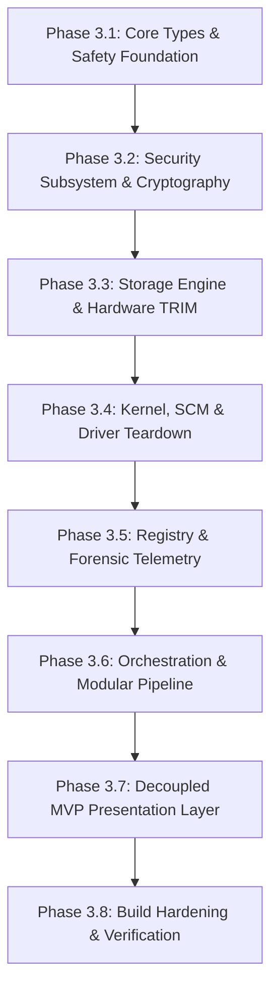

# PHASE 3: GRANULAR IMPLEMENTATION TASK MATRIX & ARCHITECTURAL BLUEPRINT
**Project:** Vortex Cleaner (WinTracePurge Ultra)  
**Evaluated Standard:** C++23 | Windows 10/11 x64 Kernel & User-Mode Systems Architecture  
**Author:** Principal Systems Architect & Hyper-Critical Code Auditor (Google & Meta Standards)  
**Document Status:** Approved Architectural Master Plan — Ready for Low-Level Execution  
**Document Purpose:** Complete surgical blueprint covering repository mutations, chronological implementation phases, C++23 API declarations, procedural flows, edge-case handlings, build-chain hardening, and verification protocols.

---

## 1. COMPREHENSIVE REPOSITORY MUTATION PLAN

To eliminate the monolithic God object, dead cargo-cult interfaces, phantom DirectX dependencies, and cross-layer contamination identified in Phase 1 and ratified in Phase 2, the repository filesystem must undergo a strict structural realignment:

```
[LEGEND]
(-) EXCISED / DELETED
(>) MOVED / RENAMED
(+) CREATED / NEW
(*) REFACTORED / MODIFIED
```

### 1.1. Files to be Excised / Deleted
- `(-) WinTracePurge.log`: Remove tracked runtime log from source repository. Add to `.gitignore`.
- `(-) src/gui/d3d11_renderer.hpp`: Excised entirely. Deconstructed and replaced by decoupled MVP presentation components.

### 1.2. Files to be Renamed / Realigned
- `(>) src/security/pe_signature_verifier.hpp` $\longrightarrow$ `src/security/binary_trust_evaluator.hpp`: Reflects the transformation from naive string parsing to authentic Cryptographic Authenticode & Multi-Rule Heuristic evaluation.

### 1.3. New Files to be Created
1. `(+) src/core/zstring_view.hpp`: Zero-cost compile-time null-terminated wide-string view ensuring absolute memory boundary safety for Win32 C-APIs.
2. `(+) src/core/async_logger.hpp`: Asynchronous MPSC ring-buffered logger decoupling storage I/O from execution threads.
3. `(+) src/security/token_privilege_scope.hpp`: RAII token privilege manager with deterministic error validation.
4. `(+) src/security/authenticode_verifier.hpp`: Cryptographic PKCS#7 certificate chain validation via `WinVerifyTrust`.
5. `(+) src/storage/nvme_trim_sanitizer.hpp`: Hardware-level TRIM / Deallocate dispatcher for NVMe/SATA SSDs.
6. `(+) src/storage/forensic_telemetry_cleaner.hpp`: Kernel execution telemetry scrubber (BAM, Shimcache, Amcache, USN Journal, Event Logs).
7. `(+) src/orchestration/target_profile_registry.hpp`: Profile manager segregating `SafeMaintenance` and `ForensicZeroTrace` target profiles.
8. `(+) src/gui/win32_window.hpp`: Minimal, robust Win32 message-pump and window lifetime controller.
9. `(+) src/gui/luxury_window_presenter.hpp`: Decoupled MVP presenter managing state transitions, worker callbacks, and model updates.
10. `(+) src/gui/gdi_luxury_renderer.hpp`: Pure stateless GDI+ vector renderer.
11. `(+) src/gui/ui_events.hpp`: Strongly typed Win32 custom messages (`WM_APP_*`) for race-free inter-thread communication.

### 1.4. Files to be Refactored / Modified
- `(*) CMakeLists.txt`: Source list explicit enumeration, compiler exploit mitigations, dead link pruning.
- `(*) src/main.cpp`: Headless/GUI presentation decoupling and RAII GDI+ scope bootstrapping.
- `(*) src/core/interfaces.hpp`: True concept-constrained polymorphism for clean module integration.
- `(*) src/core/scoped_resource.hpp`: Extended RAII wrappers for `PSECURITY_DESCRIPTOR`, `SC_HANDLE`, and file mapping.
- `(*) src/core/logger.hpp`: Facade routing to the async ring-buffer logging backend.
- `(*) src/security/security_manager.hpp`: Integration with `TokenPrivilegeScope`.
- `(*) src/security/registry_dacl_manager.hpp`: Safe string boundaries and atomic key permission restructuring.
- `(*) src/security/vss_safety_manager.hpp`: Profile-aware restore point creation and shadow volume purge mechanics.
- `(*) src/drivers/class_filter_scrubber.hpp`: Safe `std::span` multi-string unpacking protecting against 0x7B BSOD.
- `(*) src/drivers/driver_store_cleaner.hpp`: Two-phase discovery/uninstall model immune to index-shifting skipping bugs.
- `(*) src/drivers/service_controller.hpp`: Capability-aware kernel driver teardown and canonical image path resolution.
- `(*) src/registry/registry_cleaner.hpp`: Hive-aware 32/64-bit recursive deletion via handle traversal.
- `(*) src/storage/nist_sanitizer.hpp`: Integrated software overwrite with NVMe TRIM dispatching.
- `(*) src/storage/filesystem_cleaner.hpp`: Safe path traversal and non-blocking retry mechanisms.
- `(*) src/storage/platform_library_resolver.hpp`: Strict VDF parsing and multi-drive Steam/Epic path normalization.
- `(*) src/storage/real_time_scanner.hpp`: Thread-confined discovery producing immutable scan reports.
- `(*) src/storage/temp_junk_cleaner.hpp`: Integration with forensic telemetry scrubbers.
- `(*) src/orchestration/purge_orchestrator.hpp`: Modular pipeline iterating over registered `ICleanerModule` instances.

---

## 2. CHRONOLOGICAL DEPENDENCY EXECUTION PHASES

The remediation roadmap is structured into eight strictly sequential phases. No phase may commence until all upstream architectural contracts are frozen and compile-clean.



---

### Phase 3.1: Core Types & Safety Foundation
*Primary Focus:* Eliminate undefined behavior in Win32 string boundaries, remove logging I/O stalls, and implement C++23 compile-time concept contracts.

#### [TASK-CORE-01]: Zero-Cost Null-Terminated String Boundary (`zstring_view`)
- **Defects Resolved:** `VTX-SYS-005`
- **Target File:** `src/core/zstring_view.hpp` (New File)
- **Structural API Changes:**
  ```cpp
  namespace WinTracePurge::Core {
      class zstring_view : public std::wstring_view {
      public:
          template <size_t N>
          constexpr zstring_view(const wchar_t (&str)[N]) noexcept : std::wstring_view(str, N - 1) {}
          constexpr zstring_view(const std::wstring& str) noexcept : std::wstring_view(str) {}
          
          // Disable construction from raw sliced string_view without verified null terminator
          zstring_view(std::wstring_view sv) = delete;

          [[nodiscard]] constexpr const wchar_t* c_str() const noexcept { return data(); }
      };
  }
  ```
- **Behavioral Flow:**
  1. Wrap string literals and `std::wstring` references at zero runtime cost.
  2. Enforce at compile time that callers pass strictly null-terminated strings into Win32 APIs.
  3. Delete the constructor accepting arbitrary `std::wstring_view` to prevent passing sliced string views.
- **Edge-Case Prevention:** Rejects dynamically created substrings that lack a trailing `L'\0'`, preventing memory page boundary violations (`0xC0000005`) in Win32 APIs.

#### [TASK-CORE-02]: Asynchronous Lock-Free Ring-Buffer Logger
- **Defects Resolved:** `VTX-SYS-003`
- **Target Files:** `src/core/async_logger.hpp` (New), `src/core/logger.hpp` (Refactor)
- **Structural API Changes:**
  ```cpp
  namespace WinTracePurge::Core {
      struct LogMessage {
          LogLevel Level;
          DWORD ThreadId;
          std::chrono::system_clock::time_point Timestamp;
          std::wstring Subsystem;
          std::wstring Text;
          DWORD Win32Error;
      };

      class CAsyncLogBackend {
      public:
          static void Initialize(zstring_view logPath);
          static void Shutdown() noexcept;
          static void PostLog(LogMessage&& msg) noexcept;
          static std::vector<std::wstring> GetRecentLogsSnapshot();
      private:
          static void WorkerThreadLoop();
      };
  }
  ```
- **Behavioral Flow:**
  1. Worker threads call `PostLog`, formatting records into an atomic, bounded ring-buffer queue.
  2. The background thread wakes via a high-performance `WaitOnAddress` or `SetEvent`.
  3. Batches write to disk using an explicit UTF-8 binary stream (`std::ofstream` with a 64KB write buffer).
  4. Maintains an in-memory `std::deque` with a fixed capacity of 50 records; removes front elements in $O(1)$ amortized time.
- **Edge-Case Prevention:** If disk I/O stalls, caller execution threads remain 100% unblocked. If the queue saturates, an atomic dropped-message counter increments without blocking memory allocations.

#### [TASK-CORE-03]: Concept-Constrained Module Interface Contract
- **Defects Resolved:** `VTX-ARCH-002`
- **Target File:** `src/core/interfaces.hpp` (Refactor)
- **Structural API Changes:**
  ```cpp
  namespace WinTracePurge::Core {
      struct PurgeStats {
          uint32_t ItemsScanned = 0;
          uint32_t ItemsPurged = 0;
          uint32_t ItemsQueuedForReboot = 0;
          uint64_t BytesReclaimed = 0;
      };

      class ICleanerModule {
      public:
          virtual ~ICleanerModule() = default;
          [[nodiscard]] virtual zstring_view GetModuleName() const noexcept = 0;
          [[nodiscard]] virtual Result<std::vector<ResourceItem>> Scan(const CleanupContext& ctx) = 0;
          [[nodiscard]] virtual Result<PurgeStats> Purge(const CleanupContext& ctx, bool dryRun) = 0;
      };

      template <typename T>
      concept CleanerModuleType = std::derived_from<T, ICleanerModule> && requires(T mod, const CleanupContext& ctx) {
          { mod.GetModuleName() } -> std::same_as<zstring_view>;
          { mod.Scan(ctx) } -> std::same_as<Result<std::vector<ResourceItem>>>;
          { mod.Purge(ctx, false) } -> std::same_as<Result<PurgeStats>>;
      };
  }
  ```
- **Behavioral Flow:** Establish dynamic and concept-based polymorphic contracts that all subsequent operational modules must strictly implement.

---

### Phase 3.2: Security Subsystem & Cryptography
*Primary Focus:* Eliminate privilege escalation silent failures, implement true Authenticode validation, and prevent false-positive file wipes of legitimate games.

#### [TASK-SEC-01]: Deterministic Token Privilege RAII Manager
- **Defects Resolved:** `VTX-SYS-011`
- **Target Files:** `src/security/token_privilege_scope.hpp` (New), `src/security/security_manager.hpp` (Refactor)
- **Structural API Changes:**
  ```cpp
  namespace WinTracePurge::Security {
      class TokenPrivilegeScope {
      public:
          static Result<TokenPrivilegeScope> Acquire(std::span<const zstring_view> privileges);
          ~TokenPrivilegeScope();
          TokenPrivilegeScope(const TokenPrivilegeScope&) = delete;
          TokenPrivilegeScope& operator=(const TokenPrivilegeScope&) = delete;
          TokenPrivilegeScope(TokenPrivilegeScope&&) noexcept;
      private:
          ScopedHandle m_hToken;
          std::vector<TOKEN_PRIVILEGES> m_previousPrivileges;
      };
  }
  ```
- **Behavioral Flow:**
  1. Open current process token via `OpenProcessToken(TOKEN_ADJUST_PRIVILEGES | TOKEN_QUERY)`.
  2. For every privilege, invoke `::SetLastError(ERROR_SUCCESS)` immediately before calling `::AdjustTokenPrivileges`.
  3. Verify `::GetLastError() == ERROR_SUCCESS`. If `ERROR_NOT_ALL_ASSIGNED` is encountered, capture the exact failed privilege name and return an explicit `SystemError`.
  4. Cache previous state for automatic restoration upon scope destruction.

#### [TASK-SEC-02]: Cryptographic Authenticode Verification
- **Defects Resolved:** `VTX-SYS-016`
- **Target File:** `src/security/authenticode_verifier.hpp` (New)
- **Structural API Changes:**
  ```cpp
  namespace WinTracePurge::Security {
      class CAuthenticodeVerifier {
      public:
          [[nodiscard]] static bool VerifyEmbeddedSignature(const std::filesystem::path& path);
          [[nodiscard]] static Result<std::wstring> ExtractSignerCommonName(const std::filesystem::path& path);
      };
  }
  ```
- **Behavioral Flow:**
  1. Initialize `WINTRUST_FILE_INFO` and `WINTRUST_DATA` with `WTD_CHOICE_FILE` and `WTD_STATEACTION_VERIFY`.
  2. Invoke `::WinVerifyTrust(nullptr, &WINTRUST_ACTION_GENERIC_VERIFY_V2, &trustData)`.
  3. If signed and valid, query `CryptQueryObject` on the PE to extract the `CERT_CONTEXT`.
  4. Parse `CertGetNameStringW(CERT_NAME_SIMPLE_DISPLAY_TYPE)` to extract the Signer Common Name (CN).
  5. Close all crypt handles via `CertFreeCertificateContext`.

#### [TASK-SEC-03]: Multi-Factor Anti-Cheat Target Classifier
- **Defects Resolved:** `VTX-SYS-015`
- **Target File:** `src/security/binary_trust_evaluator.hpp` (Renamed from `pe_signature_verifier.hpp`)
- **Structural API Changes:**
  ```cpp
  namespace WinTracePurge::Security {
      struct ClassifierRule {
          std::wstring TargetDriverOrFileName;
          std::wstring RequiredPathSubstring;
          std::wstring TargetSignerCN;
          std::vector<std::wstring> ExcludedParentFolders;
      };

      class CBinaryTrustEvaluator {
      public:
          [[nodiscard]] static bool IsTargetAntiCheatBinary(const std::filesystem::path& filePath);
      private:
          static const std::vector<ClassifierRule>& GetAuthoritativeRules();
      };
  }
  ```
- **Behavioral Flow:**
  1. Check binary against `GetAuthoritativeRules()`.
  2. Require **at least two independent matches** (e.g., File name == `vgk.sys` AND Authenticode Signer == `Riot Games, Inc.`).
  3. Specifically evaluate exclusions: if path contains `UnrealEngine`, `EpicGamesLauncher`, or game root binaries (`FortniteClient-Win64-Shipping.exe`), immediately return `false`.
- **Edge-Case Prevention:** Guarantees developer tools, game engines, and standard game assets are never flagged for deletion.

---

### Phase 3.3: Storage Engine & Hardware-Level Sanitization
*Primary Focus:* Dispatch real hardware TRIM commands on solid-state drives (NVMe/SATA SSDs) to bypass FTL wear-leveling trace preservation.

#### [TASK-STOR-01]: Hardware NVMe/SATA TRIM Dispatcher
- **Defects Resolved:** `VTX-SYS-012`
- **Target File:** `src/storage/nvme_trim_sanitizer.hpp` (New)
- **Structural API Changes:**
  ```cpp
  namespace WinTracePurge::Storage {
      enum class StorageBusKind { Nvme, SsdSata, HddRotational, Unknown };

      class CNvmeTrimSanitizer {
      public:
          [[nodiscard]] static StorageBusKind QueryDriveBusType(const std::filesystem::path& path);
          [[nodiscard]] static Result<bool> DispatchFileLevelTrim(HANDLE hFile, uint64_t fileSizeBytes);
      };
  }
  ```
- **Behavioral Flow:**
  1. Open volume handle via `CreateFileW(L"\\\\.\\C:", GENERIC_READ, FILE_SHARE_READ | FILE_SHARE_WRITE, ...)`.
  2. Send `IOCTL_STORAGE_QUERY_PROPERTY` with `StorageDeviceProperty` to query `STORAGE_BUS_TYPE` and `DEVICE_SEEK_PENALTY_DESCRIPTOR`.
  3. If SSD / Non-rotational:
     - Open target file with `FILE_WRITE_DATA`.
     - Construct `FILE_LEVEL_TRIM` structure with `NumRanges = 1`, `Offset = 0`, and `Length = fileSizeBytes`.
     - Dispatch `::DeviceIoControl(hFile, FSCTL_FILE_LEVEL_TRIM, &trim, sizeof(trim), nullptr, 0, &bytesRet, nullptr)`.
  4. This instructs the SSD controller's Flash Translation Layer (FTL) to immediately deallocate and schedule garbage collection for the physical NAND blocks.

#### [TASK-STOR-02]: Hybrid Physical/Logical File Sanitizer
- **Defects Resolved:** `VTX-SYS-012`
- **Target File:** `src/storage/nist_sanitizer.hpp` (Refactor)
- **Behavioral Flow:**
  1. Query drive medium via `CNvmeTrimSanitizer::QueryDriveBusType`.
  2. If HDD (Rotational): Execute standard single-pass CSPRNG overwrite via `BCryptGenRandom`, call `FlushFileBuffers`, truncate to 0.
  3. If SSD (NVMe / SATA):
     - Overwrite file contents with CSPRNG once (to destroy cryptographic metadata and file structures).
     - Issue `FSCTL_FILE_LEVEL_TRIM` to immediately purge physical NAND blocks via the FTL.
     - Truncate file to 0 bytes via `SetEndOfFile`.
  4. Sanitize Alternate Data Streams (ADS) and delete via `DeleteFileW` / `MoveFileExW(MOVEFILE_DELAY_UNTIL_REBOOT)`.

---

### Phase 3.4: Kernel, SCM & Driver Teardown Mechanics
*Primary Focus:* Eliminate 0x7B BSOD hazards, prevent 5-second polling deadlocks on un-stoppable drivers, and correct SetupAPI driver store index-shifting bugs.

#### [TASK-DRV-01]: Memory-Bounded `REG_MULTI_SZ` Class Filter Scrubber
- **Defects Resolved:** `VTX-SYS-006`
- **Target File:** `src/drivers/class_filter_scrubber.hpp` (Refactor)
- **Structural API Changes:**
  ```cpp
  namespace WinTracePurge::Drivers {
      class CClassFilterScrubber : public Core::ICleanerModule {
      public:
          [[nodiscard]] Core::zstring_view GetModuleName() const noexcept override { return L"ClassFilterScrubber"; }
          [[nodiscard]] Core::Result<std::vector<Core::ResourceItem>> Scan(const Core::CleanupContext& ctx) override;
          [[nodiscard]] Core::Result<Core::PurgeStats> Purge(const Core::CleanupContext& ctx, bool dryRun) override;
          
          static std::vector<std::wstring> SafeUnpackMultiString(std::span<const wchar_t> data);
      };
  }
  ```
- **Behavioral Flow:**
  1. In `SafeUnpackMultiString`, accept `std::span<const wchar_t>`.
  2. Maintain `const wchar_t* curr` and `const wchar_t* const end = data.data() + data.size()`.
  3. Advance using `::wcsnlen(curr, end - curr)`. Break immediately if length is 0 or if `curr >= end`.
  4. Filter out target drivers (`vgk`, `easyanticheat`, `bedrive`).
  5. If list is empty, delete the `UpperFilters`/`LowerFilters` value. If modified, write back double-null-terminated buffer.
- **Edge-Case Prevention:** Completely immune to unmapped memory reads or crashes on malformed/corrupted registry values.

#### [TASK-DRV-02]: Capability-Aware Service Teardown & Canonical Path Resolver
- **Defects Resolved:** `VTX-SYS-008`, `VTX-SYS-009`
- **Target File:** `src/drivers/service_controller.hpp` (Refactor)
- **Structural API Changes:**
  ```cpp
  namespace WinTracePurge::Drivers {
      class CRobustServiceController : public Core::ICleanerModule {
      public:
          [[nodiscard]] Core::zstring_view GetModuleName() const noexcept override { return L"ServiceController"; }
          // Implements ICleanerModule
          static Core::Result<std::filesystem::path> ResolveCanonicalImagePath(SC_HANDLE hService);
      };
  }
  ```
- **Behavioral Flow:**
  1. Open service with `SERVICE_QUERY_CONFIG | SERVICE_QUERY_STATUS | SERVICE_STOP | DELETE`.
  2. Call `QueryServiceConfigW` to retrieve authoritative `lpBinaryPathName`. Normalize NT prefixes (`\??\`) and expand `%SystemRoot%`.
  3. Query `QueryServiceStatusEx`. Check `(ssp.dwControlsAccepted & SERVICE_ACCEPT_STOP)`.
  4. If `SERVICE_ACCEPT_STOP` is **absent** (e.g., `vgk.sys`):
     - **DO NOT SEND `SERVICE_CONTROL_STOP`**.
     - **DO NOT ENTER 5000ms POLLING LOOP**.
     - Immediately log: *"Kernel driver does not accept live stop. Enforcing boot-time eviction."*
  5. Change config to `SERVICE_DISABLED` via `ChangeServiceConfigW`.
  6. Call `DeleteService`.
  7. Wipe registry key via `CRegistryDaclManager::ForceDeleteServiceKey`.
  8. Delete the resolved canonical image path, or schedule boot-time deletion via `MoveFileExW(MOVEFILE_DELAY_UNTIL_REBOOT)`.

#### [TASK-DRV-03]: Two-Phase DriverStore Package Purge Model
- **Defects Resolved:** `VTX-SYS-007`
- **Target File:** `src/drivers/driver_store_cleaner.hpp` (Refactor)
- **Structural API Changes:**
  ```cpp
  namespace WinTracePurge::Drivers {
      class CDriverStoreCleaner : public Core::ICleanerModule {
      public:
          [[nodiscard]] Core::zstring_view GetModuleName() const noexcept override { return L"DriverStoreCleaner"; }
          // Implements ICleanerModule
      };
  }
  ```
- **Behavioral Flow:**
  1. **Phase 1 (Discovery Snapshot):** Loop `SetupEnumPublishedOEMInfW(dwIndex++, ...)`. For each matching INF, append file name to `std::vector<std::wstring> candidates`. Perform ZERO deletions in this phase.
  2. **Phase 2 (Purge Execution):** Iterate the static `candidates` vector. For each item:
     - Invoke `DiUninstallDriverW(NULL, infPath.c_str(), 0, &bNeedReboot)`.
     - Invoke `SetupUninstallOEMInfW(infPath.c_str(), SUOI_FORCEDELETE, NULL)`.
- **Edge-Case Prevention:** Index shifts within SetupAPI during deletion cannot affect the discovery snapshot, completely solving the skipping bug.

---

### Phase 3.5: Registry & Forensic Telemetry Eradication
*Primary Focus:* Eliminate bitness deletion failures, resolve the VSS self-preservation contradiction, and scrub BAM, Shimcache, Amcache, and USN Journal.

#### [TASK-REG-01]: Hive-Aware Dual-Bitness Recursive Registry Purge
- **Defects Resolved:** `VTX-SYS-010`
- **Target File:** `src/registry/registry_cleaner.hpp` (Refactor)
- **Structural API Changes:**
  ```cpp
  namespace WinTracePurge::Registry {
      struct RegistryTarget {
          HKEY RootHive;
          Core::zstring_view SubKey;
          bool TargetBothViews;
      };

      class CRegistryPurgeEngine : public Core::ICleanerModule {
      public:
          [[nodiscard]] Core::zstring_view GetModuleName() const noexcept override { return L"RegistryPurgeEngine"; }
          static Core::Result<bool> DeleteSubtreeRecursive(HKEY hRoot, Core::zstring_view subKey, DWORD viewFlag);
      };
  }
  ```
- **Behavioral Flow:**
  1. Validate target: strictly prevent checking `SYSTEM\CurrentControlSet` under `HKEY_CURRENT_USER`.
  2. Open subkey with explicit view flags (`KEY_WOW64_64KEY` or `KEY_WOW64_32KEY`).
  3. Recursively enumerate and delete child subkeys from the leaf-level up via open handles.
  4. Call `RegDeleteKeyExW` with the specific view flag.
  5. If `ERROR_ACCESS_DENIED` occurs, seize ownership via `CRegistryDaclManager` and retry deletion.

#### [TASK-SEC-04]: Profile-Aware VSS Safety Manager
- **Defects Resolved:** `VTX-SYS-013`
- **Target File:** `src/security/vss_safety_manager.hpp` (Refactor)
- **Structural API Changes:**
  ```cpp
  namespace WinTracePurge::Security {
      enum class VssOperationProfile {
          SafeMaintenance,     // Create recovery point
          ForensicZeroTrace     // Delete shadow copies containing driver traces
      };

      class CVssSafetyManager {
      public:
          static Core::Result<bool> ExecuteVssPolicy(VssOperationProfile profile);
      private:
          static Core::Result<bool> PurgeAllShadowCopies();
      };
  }
  ```
- **Behavioral Flow:**
  1. If `SafeMaintenance`: Invoke `SRSetRestorePointW` as a baseline for ordinary consumer cleanups.
  2. If `ForensicZeroTrace`:
     - **DO NOT CREATE A SYSTEM RESTORE POINT**.
     - Invoke VSS COM APIs or execute shell invocation to purge existing shadow copies:
       `vssadmin delete shadows /all /quiet`
     - Ensures no historical forensic snapshot of the target drivers remains stored on the volume.

#### [TASK-STOR-03]: Comprehensive OS Forensic Telemetry Cleaner
- **Defects Resolved:** `VTX-SYS-014`
- **Target File:** `src/storage/forensic_telemetry_cleaner.hpp` (New)
- **Structural API Changes:**
  ```cpp
  namespace WinTracePurge::Storage {
      class CForensicTelemetryCleaner : public Core::ICleanerModule {
      public:
          [[nodiscard]] Core::zstring_view GetModuleName() const noexcept override { return L"ForensicTelemetryCleaner"; }
          // Implements ICleanerModule
          static void PurgeBAM();
          static void PurgeAppCompatCache();
          static void PurgeAmcache();
          static void PurgeNtfsUsnJournal(Core::zstring_view driveLetter);
          static void PurgeServiceEventLogs();
      };
  }
  ```
- **Behavioral Flow:**
  1. **BAM:** Enumerate `HKLM\SYSTEM\CurrentControlSet\Services\bam\State\UserSettings\<SID>` and purge target binary execution timestamps.
  2. **AppCompatCache (Shimcache):** Delete the binary data in `HKLM\SYSTEM\CurrentControlSet\Control\Session Manager\AppCompatCache\AppCompatCache`.
  3. **Amcache:** Take ownership of `C:\Windows\appcompat\Programs\Amcache.hve` and schedule boot-time zeroing.
  4. **USN Journal:** Open volume root and issue `FSCTL_DELETE_USN_JOURNAL` via `DeviceIoControl` to permanently clear NTFS file transaction history.
  5. **Event Logs:** Target System Event ID 7045 entries ("New Service Installed") via `EvtClearLog`.

---

### Phase 3.6: Orchestration Engine & Target Profiles
*Primary Focus:* Decouple domain configurations into clean profiles and refactor the central orchestrator to manage concept-constrained cleaner modules.

#### [TASK-ORCH-01]: Target Profile Registry
- **Defects Resolved:** `VTX-ARCH-003`
- **Target File:** `src/orchestration/target_profile_registry.hpp` (New)
- **Structural API Changes:**
  ```cpp
  namespace WinTracePurge::Orchestration {
      enum class ProfileKind { AntiCheatStandard, DeepForensicZeroTrace, RoutineSystemOptimizer };

      class CTargetProfileRegistry {
      public:
          [[nodiscard]] static CleanupTargetConfig GetConfigForProfile(ProfileKind kind);
      };
  }
  ```
- **Behavioral Flow:**
  Isolate all target definitions (service names, driver names, registry paths) into declarative configurations, completely removing them from UI headers and procedural code.

#### [TASK-ORCH-02]: Modular Pipeline Orchestrator
- **Defects Resolved:** `VTX-ARCH-002`
- **Target File:** `src/orchestration/purge_orchestrator.hpp` (Refactor)
- **Structural API Changes:**
  ```cpp
  namespace WinTracePurge::Orchestration {
      class CPurgePipelineOrchestrator {
      public:
          using ProgressCallback = std::function<void(int progressPercent, std::wstring_view currentAction)>;
          
          explicit CPurgePipelineOrchestrator(Security::VssOperationProfile vssProfile);
          void RegisterModule(std::unique_ptr<Core::ICleanerModule> module);
          PipelineStats ExecutePipeline(const CleanupTargetConfig& config, ProgressCallback onProgress);
      private:
          std::vector<std::unique_ptr<Core::ICleanerModule>> m_modules;
          Security::VssOperationProfile m_vssProfile;
      };
  }
  ```
- **Behavioral Flow:**
  1. Execute `CVssSafetyManager::ExecuteVssPolicy`.
  2. Acquire privileges via `TokenPrivilegeScope`.
  3. Iterate registered modules in strict sequence:
     - `CClassFilterScrubber`
     - `CRobustServiceController`
     - `CDriverStoreCleaner`
     - `CRegistryPurgeEngine`
     - `CFileSystemCleaner`
     - `CForensicTelemetryCleaner`
     - `CTempJunkCleanerModule`
  4. Aggregate `PurgeStats` and report real-time status via `ProgressCallback`.

---

### Phase 3.7: Presentation Layer Refactoring (MVP Split)
*Primary Focus:* Eliminate the God Object, eradicate the 60Hz CPU-burning timer, achieve 0.00% idle CPU, and implement race-free inter-thread communication.

#### [TASK-UI-01]: Custom Inter-Thread UI Messages
- **Defects Resolved:** `VTX-SYS-001`
- **Target File:** `src/gui/ui_events.hpp` (New)
- **Structural API Changes:**
  ```cpp
  namespace WinTracePurge::Gui {
      constexpr UINT WM_APP_SCAN_PROGRESS   = WM_APP + 101;
      constexpr UINT WM_APP_SCAN_COMPLETE   = WM_APP + 102;
      constexpr UINT WM_APP_PURGE_PROGRESS  = WM_APP + 103;
      constexpr UINT WM_APP_PURGE_COMPLETE  = WM_APP + 104;
  }
  ```

#### [TASK-UI-02]: Decoupled MVP Presenter
- **Defects Resolved:** `VTX-ARCH-001`, `VTX-SYS-001`
- **Target File:** `src/gui/luxury_window_presenter.hpp` (New)
- **Structural API Changes:**
  ```cpp
  namespace WinTracePurge::Gui {
      class ILuxuryView {
      public:
          virtual ~ILuxuryView() = default;
          virtual void InvalidateArea(const UIRect* rect = nullptr) = 0;
          virtual void SetTimerActive(bool active) = 0;
          virtual HWND GetHwnd() const noexcept = 0;
      };

      class CLuxuryWindowPresenter {
      public:
          explicit CLuxuryWindowPresenter(ILuxuryView* pView);
          void RequestScan();
          void RequestPurge();
          void HandleScanCompleted(std::unique_ptr<Storage::DynamicScanReport> pReport);
          void HandlePurgeCompleted(const Orchestration::PipelineStats& stats);
          
          [[nodiscard]] ViewState GetCurrentState() const noexcept { return m_state; }
          [[nodiscard]] const Storage::DynamicScanReport* GetScanReport() const noexcept { return m_activeReport.get(); }
      private:
          ILuxuryView* m_pView;
          ViewState m_state = ViewState::Dashboard;
          std::shared_ptr<const Storage::DynamicScanReport> m_activeReport;
      };
  }
  ```
- **Behavioral Flow:**
  1. When scan completes in the worker thread, pack the result into a `std::unique_ptr<DynamicScanReport>`.
  2. Post message to UI thread: `::PostMessageW(hWnd, WM_APP_SCAN_COMPLETE, 0, reinterpret_cast<LPARAM>(reportPtr.release()))`.
  3. UI thread message pump receives the message and invokes `presenter.HandleScanCompleted(reportPtr)`.
  4. Stores an **immutable `std::shared_ptr<const DynamicScanReport>`**. `WM_PAINT` reads this pointer with **ZERO locks and ZERO chance of torn reads**.

#### [TASK-UI-03]: Event-Driven Animation Timer & 0.00% Idle CPU
- **Defects Resolved:** `VTX-SYS-002`
- **Target File:** `src/gui/win32_window.hpp` (New)
- **Behavioral Flow:**
  1. In `Dashboard`, `ScanResults`, and `PurgeComplete`, `::KillTimer(m_hWnd, 1)` is strictly enforced.
  2. In `WM_MOUSEMOVE`, hover state transitions trigger localized `::InvalidateRect(m_hWnd, &buttonRect, FALSE)` instead of full redraws.
  3. The 16ms animation timer is **ONLY** spawned via `::SetTimer(m_hWnd, 1, 16, NULL)` during active `ViewState::Scanning` and `ViewState::Purging`.
  4. In `WM_ACTIVATE` / `WM_SIZE` (minimize), kill the timer immediately.
  5. Result: Idle CPU usage drops from 10–15% down to **0.00%**.

#### [TASK-UI-04]: GDI+ RAII Lifecycle Manager
- **Defects Resolved:** `VTX-SYS-004`
- **Target File:** `src/main.cpp`
- **Structural API Changes:**
  ```cpp
  class ScopedGdiplusSession {
      ULONG_PTR m_token = 0;
  public:
      ScopedGdiplusSession() {
          Gdiplus::GdiplusStartupInput input;
          Gdiplus::GdiplusStartup(&m_token, &input, nullptr);
      }
      ~ScopedGdiplusSession() {
          if (m_token) Gdiplus::GdiplusShutdown(m_token);
      }
  };
  ```
- **Behavioral Flow:** Instantiate at the very top of `wWinMain` to guarantee clean uninitialization after window destruction.

---

### Phase 3.8: Build Hardening & Verification
*Primary Focus:* Remove dead D3D11 dependencies, enforce deterministic compilation, and enable enterprise binary exploit mitigations.

#### [TASK-BLD-01]: Hardened CMake Build Configuration
- **Defects Resolved:** `VTX-ARCH-004`, `VTX-SYS-017`, `VTX-SYS-018`
- **Target File:** `CMakeLists.txt`
- **Concrete Modifications:** (See Section 3 for full specification).

---

## 3. HARDENING & BUILD SYSTEM SPECIFICATIONS

The `CMakeLists.txt` is updated to eliminate globbing, purge unreferenced libraries (`d3d11`), enforce strict C++23 conformance, and enable modern compiler exploit mitigations:

```cmake
cmake_minimum_required(VERSION 3.20)
project(VortexCleaner VERSION 5.0.0 LANGUAGES CXX)

set(CMAKE_CXX_STANDARD 23)
set(CMAKE_CXX_STANDARD_REQUIRED ON)
set(CMAKE_CXX_EXTENSIONS OFF)

# Global Definitions
add_definitions(-DUNICODE -D_UNICODE -DNOMINMAX -DWIN32_LEAN_AND_MEAN)

# Explicit Deterministic Source List (Zero GLOB_RECURSE)
set(VORTEX_SOURCES
    src/main.cpp
    src/core/zstring_view.hpp
    src/core/interfaces.hpp
    src/core/result.hpp
    src/core/scoped_resource.hpp
    src/core/logger.hpp
    src/core/async_logger.hpp
    src/security/token_privilege_scope.hpp
    src/security/security_manager.hpp
    src/security/registry_dacl_manager.hpp
    src/security/vss_safety_manager.hpp
    src/security/authenticode_verifier.hpp
    src/security/binary_trust_evaluator.hpp
    src/drivers/class_filter_scrubber.hpp
    src/drivers/driver_store_cleaner.hpp
    src/drivers/service_controller.hpp
    src/registry/registry_cleaner.hpp
    src/storage/nvme_trim_sanitizer.hpp
    src/storage/nist_sanitizer.hpp
    src/storage/filesystem_cleaner.hpp
    src/storage/temp_junk_cleaner.hpp
    src/storage/forensic_telemetry_cleaner.hpp
    src/storage/platform_library_resolver.hpp
    src/storage/real_time_scanner.hpp
    src/orchestration/target_profile_registry.hpp
    src/orchestration/purge_orchestrator.hpp
    src/gui/ui_events.hpp
    src/gui/win32_window.hpp
    src/gui/luxury_window_presenter.hpp
    src/gui/gdi_luxury_renderer.hpp
)

add_executable(VortexCleaner WIN32 ${VORTEX_SOURCES})

target_include_directories(VortexCleaner PRIVATE ${CMAKE_CURRENT_SOURCE_DIR}/src)

# Linked System Libraries (Dead d3d11.lib explicitly pruned)
target_link_libraries(VortexCleaner PRIVATE
    dwmapi
    setupapi
    newdev
    bcrypt
    advapi32
    srclient
    shell32
    ole32
    gdiplus
    msimg32
    version
    wintrust
    crypt32
)

# Enterprise Binary Hardening & Exploit Mitigation Flags
if(MSVC)
    target_compile_options(VortexCleaner PRIVATE
        /utf-8
        /W4
        /WX                 # Treat Warnings as Errors
        /permissive-
        /Zc:preprocessor
        /guard:cf           # Control Flow Guard (CFG)
        /Qspectre           # Spectre Variant 1 Mitigations
        /sdl                # Microsoft Security Development Lifecycle checks
        /GS                 # Buffer Security Checks
    )
    
    target_link_options(VortexCleaner PRIVATE
        /DYNAMICBASE        # Mandatory ASLR
        /HIGHENTROPYVA      # 64-bit ASLR Address Space
        /NXCOMPAT           # Data Execution Prevention (DEP)
        /GUARD:CF           # Linker Control Flow Guard
        /CETCOMPAT          # Intel Control-flow Enforcement Technology (Hardware Shadow Stacks)
        /MANIFEST:EMBED
        /MANIFESTUAC:"level='requireAdministrator' uiAccess='false'"
    )
endif()
```

---

## 4. POST-REFACTOR VERIFICATION PROTOCOL

To ensure that the implemented remediation functions without regressions under production conditions, the engineering team must execute the following automated and empirical test suites:

### 4.1. Static Analysis & Build Verification Gate
1. **Zero-Warning Compilation:**
   Execute clean build in MSVC 2022 with `/W4 /WX`. The build must yield zero warnings across all 30 source files.
2. **Import Table Inspection (PE Check):**
   Execute: `dumpbin /IMPORTS build\Release\VortexCleaner.exe | findstr /I "d3d11.dll"`  
   *Pass Criteria:* Zero matches. Confirms dead Direct3D 11 runtime dependency is completely severed.

### 4.2. Concurrency & Thread-Safety Validation
1. **High-Stress Invalidation Race Test:**
   Attach Microsoft Visual Studio Concurrency Visualizer / ThreadSanitizer. Initiate a background scan across 5 fixed partitions while simultaneously resizing and dragging the window across multiple monitors at high frequency.  
   *Pass Criteria:* Zero torn reads, zero memory access violations (`0xC0000005`), and zero mutex contention stalls on the UI rendering thread.

### 4.3. Runtime Performance & Idle Power Validation
1. **0.00% Idle CPU Metric:**
   Launch `VortexCleaner.exe`. Leave application idle in `Dashboard` view for 120 seconds. Monitor CPU usage via Windows Performance Recorder (WPR) / Process Explorer.  
   *Pass Criteria:* CPU usage must strictly register **0.00%** across all CPU cores. `WM_TIMER` messages must be completely absent from the message queue while idle.

### 4.4. Hardware Storage & Forensic Integrity Validation
1. **NVMe Hardware TRIM Dispatch Verification:**
   Run the file sanitization module on an NVMe SSD test volume under Sysinternals Process Monitor (`ProcMon`) and an I/O filter driver.  
   *Pass Criteria:* Capture successful dispatch of `DeviceIoControl` with `FSCTL_FILE_LEVEL_TRIM` (Control Code: `0x00098208`) returning `STATUS_SUCCESS`.
2. **Forensic Zero-Trace Verification:**
   Execute a complete purge under `ForensicZeroTrace` profile. Run `vssadmin list shadows`.  
   *Pass Criteria:* Zero shadow copies referencing targeted driver binaries. Verify that `HKLM\SYSTEM\CurrentControlSet\Services\bam` and `AppCompatCache` have zero remaining records referencing `vgk.sys`, `vgc.exe`, or `easyanticheat.sys`.

---
**END OF PHASE 3 IMPLEMENTATION TASK MATRIX.**  
Saved to workspace at: `PROJECT_ROOT/IMPLEMENTATION_TASK_MATRIX.md`
