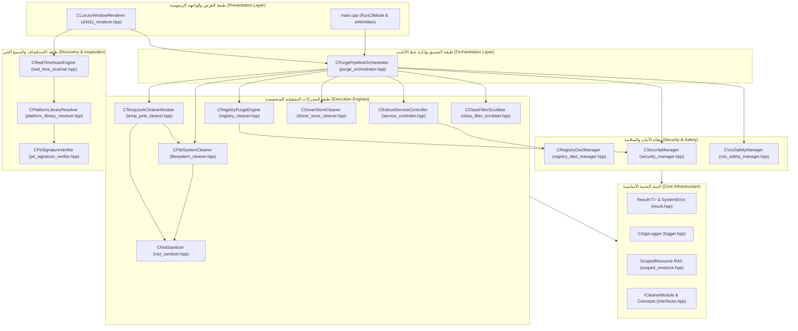
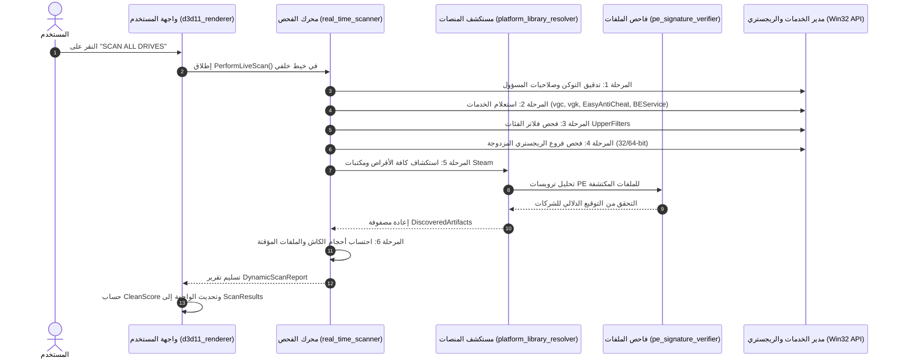
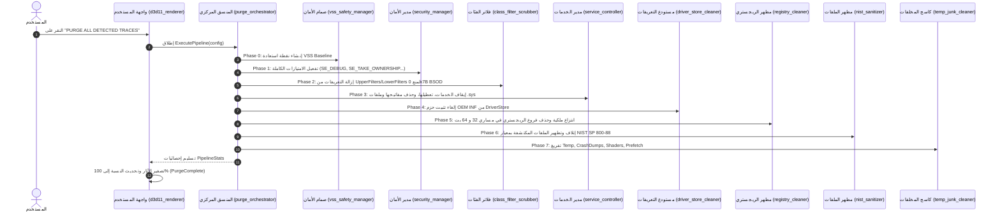

# توثيق البنية المعمارية الشاملة لمحرك Vortex Cleaner (WinTracePurge Ultra)

> **وثيقة تقنية معمارية موجهة لفرق التطوير، مهندسي النظم منخفضي المستوى (Low-Level Systems Engineers)، وفِرق هندسة العكسية والأمان.**  
> **الإصدار:** 5.0.0  
> **المعيار البرمجي:** C++23 Standard  
> **الهدف:** توثيق تفصيلي بالمللي لكافة ملفات، دوال، هياكل، وتدفقات بيانات المشروع بدون استثناء.

---

## فهرس المحتويات (Table of Contents)
1. [المقدمة والهدف الجوهري من المشروع](#1-المقدمة-والهدف-الجوهري-من-المشروع)
2. [التحديات الهندسية لنظام Windows وحلول المحرك لها](#2-التحديات-الهندسية-لنظام-windows-وحلو-المحرك-لها)
3. [الرؤية المعمارية والمصفوفة الهرمية للطبقات](#3-الرؤية-المعمارية-والمصفوفة-الهرمية-للطبقات)
4. [التوثيق البرمجي التفصيلي لكل ملف (File-by-File Specification)](#4-التوثيق-البرمجي-التفصيلي-لكل-ملف-file-by-file-specification)
   - [CMakeLists.txt](#1-cmakeliststxt)
   - [WinTracePurge.log](#2-wintracepurgelog)
   - [src/main.cpp](#3-srcmaincpp)
   - [src/core/interfaces.hpp](#4-srccoreinterfaceshpp)
   - [src/core/result.hpp](#5-srccoreresulthpp)
   - [src/core/scoped_resource.hpp](#6-srccorescoped_resourcehpp)
   - [src/core/logger.hpp](#7-srccoreloggerhpp)
   - [src/security/security_manager.hpp](#8-srcsecuritysecurity_managerhpp)
   - [src/security/pe_signature_verifier.hpp](#9-srcsecuritype_signature_verifierhpp)
   - [src/security/registry_dacl_manager.hpp](#10-srcsecurityregistry_dacl_managerhpp)
   - [src/security/vss_safety_manager.hpp](#11-srcsecurityvss_safety_managerhpp)
   - [src/registry/registry_cleaner.hpp](#12-srcregistryregistry_cleanerhpp)
   - [src/drivers/service_controller.hpp](#13-srcdriversservice_controllerhpp)
   - [src/drivers/driver_store_cleaner.hpp](#14-srcdriversdriver_store_cleanerhpp)
   - [src/drivers/class_filter_scrubber.hpp](#15-srcdriversclass_filter_scrubberhpp)
   - [src/storage/nist_sanitizer.hpp](#16-srcstoragenist_sanitizerhpp)
   - [src/storage/filesystem_cleaner.hpp](#17-srcstoragefilesystem_cleanerhpp)
   - [src/storage/temp_junk_cleaner.hpp](#18-srcstoragetemp_junk_cleanerhpp)
   - [src/storage/platform_library_resolver.hpp](#19-srcstorageplatform_library_resolverhpp)
   - [src/storage/real_time_scanner.hpp](#20-srcstoragereal_time_scannerhpp)
   - [src/orchestration/purge_orchestrator.hpp](#21-srcorchestrationpurge_orchestratorhpp)
   - [src/gui/d3d11_renderer.hpp](#22-srcguid3d11_rendererhpp)
5. [خطوط أنابيب التشغيل وتدفق البيانات (Execution Pipelines)](#5-خطوط-أنابيب-التشغيل-وتدفق-البيانات-execution-pipelines)
   - [أ. خط أنابيب الفحص الحي (Live Scan Pipeline)](#أ-خط-أنابيب-الفحص-الحي-live-scan-pipeline)
   - [ب. خط أنابيب التطهير الجراحي (Surgical Purge Pipeline)](#ب-خط-أنابيب-التطهير-الجراحي-surgical-purge-pipeline)
6. [محرك العرض والواجهة الرسومية (GUI Presentation Engine)](#6-محرك-العرض-والواجهة-الرسومية-gui-presentation-engine)
7. [متطلبات الترجمة والربط (Build & Linking Specifications)](#7-متطلبات-الترجمة-والربط-build--linking-specifications)

---

## 1. المقدمة والهدف الجوهري من المشروع

مشروع **Vortex Cleaner** (المعروف كودياً أيضاً باسم **WinTracePurge Ultra**) هو محرك جراحي منخفض المستوى تم تطويره بلغة **C++23** ليعمل على أنظمة Windows الحديثة (Windows 10/11 x64).

### الغرض الرئيسي:
صُمم هذا المحرك للتكامل داخل بيئات **HWID Spoofers** وحلول إزالة الآثار الجنائية وتطهير النظام بعمق النواة (Kernel Depth). يقوم المحرك باكتشاف، إيقاف، واقتلاع كافة برامج التشغيل (Kernel Drivers)، والخدمات المسجلة في مدير التحكم بالخدمات (SCM)، وحزم التعريفات المخزنة في الـ DriverStore، وتفريغات الذاكرة (Crash Dumps)، وبصمات التسجيل المزدوجة (32/64-bit Registry Subtrees)، وآثار منصات الألعاب ومكافحات الغش (Anti-Cheat Engines) مثل:
- **Riot Vanguard** (`vgk.sys`, `vgc.exe`, `vgc`)
- **EasyAntiCheat** (`easyanticheat.sys`, `easyanticheat_eos.sys`, `EasyAntiCheat`)
- **BattlEye** (`bedrive.sys`, `beservice.exe`, `BEService`)

---

## 2. التحديات الهندسية لنظام Windows وحلول المحرك لها

| التحدي الهندسي في بنية Windows | النتيجة الكارثية في برامج التنظيف التقليدية | الحل الهندسي المطبق في Vortex Cleaner |
| :--- | :--- | :--- |
| **PnP Class Filters (UpperFilters)** | انهيار إقلاع الويندوز بشاشة زرقاء **0x7B BSOD** بسبب فقدان ملف تعريف الكيبورد/التخزين المسجل في الفلتر. | فحص وتطهير قيم `UpperFilters` و `LowerFilters` في كافة فئات العتاد (GUIDs) برمجياً قبل حذف التعريفات. |
| **أذونات النظام و TrustedInstaller** | فشل الحذف وظهور خطأ `Access Denied` بسبب ملكية النظام للكائنات ومفاتيح الخدمات. | رفع صلاحيات التوكن بالكامل، ثم الاستيلاء الجبري على الملكية (Ownership Seizure) وإعادة بناء قائمة التحكم بالوصول (DACL). |
| **حجز برامج التشغيل قيد التشغيل (Locked Sys)** | فشل حذف ملف الـ `.sys` أثناء تشغيله في الذاكرة ومساحة النواة. | تعطيل الخدمة فورياً (`SERVICE_DISABLED`)، ثم جدولة الحذف لجلسة الإقلاع القادمة عبر `MoveFileExW` بنمط `MOVEFILE_DELAY_UNTIL_REBOOT`. |
| **استرجاع البيانات المحذوفة جنائياً** | إمكانية استرجاع ملفات التتبع وسجلات البصمة عبر برامج استرداد الملفات و Forensics Tools. | إتلاف فيزيائي بموجب معيار **NIST SP 800-88 Rev. 1** عبر استبدال المحتوى ببيانات عشوائية مشفرة ثم تطهير الـ ADS وتصفير الحجم. |
| **مستودع تعريفات ويندوز (DriverStore)** | إعادة تثبيت التعريفات تلقائياً بمجرد إعادة تشغيل النظام عبر الـ PnP Manager. | استخدام واجهات `SetupAPI` و `NewDev` لاقتلاع ملفات `oem*.inf` المنشورة واستدعاء `DiUninstallDriverW`. |

---

## 3. الرؤية المعمارية والمصفوفة الهرمية للطبقات

تم تصميم المشروع وفق معمارية متعددة الطبقات (Layered Architecture) تضمن الفصل الدقيق بين المسؤوليات (Separation of Concerns):



---

## 4. التوثيق البرمجي التفصيلي لكل ملف (File-by-File Specification)

فيما يلي فحص شامل وقراءة حرفية لكل ملف من ملفات المشروع البالغ عددها 22 ملفاً:

---

### 1. [CMakeLists.txt](file:///d:/VIP/Project/driver-level%20spoofer/Vortex%20Cleaner/CMakeLists.txt)
- **الموقع:** الجذر الرئيسي للمشروع.
- **المسؤولية:** ملف تهيئة بناء المشروع بواسطة CMake.
- **أبرز الإعدادات والخصائص:**
  - `cmake_minimum_required(VERSION 3.20)`: يتطلب إصدار CMake حديث يدعم C++23.
  - `project(VortexCleaner VERSION 5.0.0 LANGUAGES CXX)`: يحدد اسم المشروع ورقم نسخته ونوع اللغة.
  - `set(CMAKE_CXX_STANDARD 23)` و `set(CMAKE_CXX_STANDARD_REQUIRED ON)`: إجبار المترجم على تطبيق معيار **C++23** الكامل، ورفض التنازل إلى معايير أقدم.
  - `add_definitions(-DUNICODE -D_UNICODE)`: تفعيل ترميز الـ Unicode في كافة استدعاءات Win32 API.
  - تجميع الملفات عبر `file(GLOB_RECURSE SOURCES "src/*.cpp" "src/*.hpp")`.
  - توليد ملف تنفيذي بنمط النوافذ: `add_executable(VortexCleaner WIN32 ${SOURCES})`.
  - **ربط مكتبات النظام الحيوية:**
    - `dwmapi`: لإدارة مؤثرات النوافذ المتقدمة مثل Dark Mode و DwmCornerPreference.
    - `d3d11`: لدعم مكتبة الرسوميات DirectX 11.
    - `setupapi`, `newdev`: للتعامل مع برامج التشغيل ومستودع تعريفات ويندوز (DriverStore).
    - `bcrypt`: استدعاء واجهات التشفير ومولدات الأرقام العشوائية الآمنة (CSPRNG).
    - `advapi32`: للتحكم في الأذونات، مفاتيح الريجستري، ومدير الخدمات (SCM).
    - `srclient`: للتعامل مع خدمة نقاط استعادة النظام (System Restore Client).
    - `shell32`, `ole32`: للتعامل مع واجهات الـ Shell والحصول على مسارات المجلدات الخاصة (`SHGetKnownFolderPath`).
    - `gdiplus`, `msimg32`: محرك رسم الواجهة الرسومية الخالية من الوميض.
    - `version`: لقراءة ترويسات وموارد الملفات التنفيذية (PE Version Info).
  - إعدادات مترجم MSVC:
    - الأعلام: `/utf-8 /W4 /permissive- /Zc:preprocessor`.
    - ربط المانيفست المدمج لإجبار التشغيل كمسؤول:  
      `/MANIFEST:EMBED /MANIFESTUAC:"level='requireAdministrator' uiAccess='false'"`

---

### 2. [WinTracePurge.log](file:///d:/VIP/Project/driver-level%20spoofer/Vortex%20Cleaner/WinTracePurge.log)
- **الموقع:** الجذر الرئيسي للمشروع.
- **المسؤولية:** سجل نصي لجلسات التشغيل السابقة للأداة.
- **المحتوى:** يوثق طوابع زمنية دقيقة لعمليات التهيئة مثل:
  - بدء جلسة العمل: `=== WinTracePurge Session Started ===`
  - تهيئة محرك الواجهة الرسومية: `[GUI] Initializing Luxury Window Renderer`
  - تسجيل معرف الخيط التنفيذي `[TID:16280]`.

---

### 3. [src/main.cpp](file:///d:/VIP/Project/driver-level%20spoofer/Vortex%20Cleaner/src/main.cpp)
- **الموقع:** نقطة انطلاق البرنامج الرئيسية.
- **المسؤولية:** توفير نقطتي تشغيل بديلتين: سطر الأوامر (CLI) أو الواجهة الرسومية الفاخرة (GUI).
- **الدوال والمكونات:**
  - `void RunCliMode()`:
    - تُطبع شاشة ترحيبية تحدد المعايير المتبعة (`C++23 Standards | NIST SP 800-88 | PatchGuard Compliant`).
    - تقوم بتعبئة هيكل `CleanupTargetConfig` بقيم افتراضية لأشهر أهداف مكافحات الغش (Vanguard: `vgk.sys`, `vgc` | EasyAntiCheat: `easyanticheat.sys` | BattlEye: `bedrive.sys`).
    - تُمرر Lambda Callback لطباعة تقدم العملية بالنسبة المئوية.
    - تستدعي خط الأنابيب `CPurgePipelineOrchestrator::ExecutePipeline`.
    - تطبع ملخصاً مفصلاً لعدد الخدمات التي أوقفت، حزم التعريفات المحذوفة، مفاتيح الريجستري المطهرة، والملفات المعقمة.
  - `int WINAPI wWinMain(HINSTANCE hInstance, HINSTANCE hPrevInstance, PWSTR pCmdLine, int nCmdShow)`:
    - تفحص سطر الأوامر `pCmdLine`، وإذا احتوى على الفلاج `--cli`، تقوم بحجز نافذة كونسول عبر `AllocConsole()` وإعادة توجيه المسارات القياسية عبر `freopen_s` إلى `CONOUT$` و `CONIN$` وتشغيل كود الـ CLI.
    - في الوضع الافتراضي، تستدعي `WinTracePurge::Gui::CLuxuryWindowRenderer::CreateLuxuryWindow` بمقاس 1000x600 بكسل.
    - تُدير حلقة معالجة الرسائل القياسية (Standard Message Pump) عبر `GetMessageW` و `DispatchMessageW`.

---

### 4. [src/core/interfaces.hpp](file:///d:/VIP/Project/driver-level%20spoofer/Vortex%20Cleaner/src/core/interfaces.hpp)
- **الموقع:** نواة المشروع التجريدية.
- **المسؤولية:** إرساء العقود البرمجية (Contracts) والمفاهيم (Concepts) للوحدات المكونة للمحرك.
- **الهياكل والواجهات:**
  - التعداد `TargetType`:
    - `DriverService`: خدمات برامج تشغيل النواة.
    - `DriverStorePackage`: حزم التعريفات OEM.
    - `RegistryKey`: مفاتيح السجل.
    - `FileSystemPath`: مسارات الملفات والمجلدات.
    - `ClassFilter`: فلاتر فئات الأجهزة.
    - `TemporaryDirectory`: مسارات الملفات المؤقتة.
  - الهيكل `ResourceItem`:
    - `TargetType Type`: نوع المورد.
    - `std::wstring PathOrIdentifier`: المسار أو المعرف.
    - `std::wstring Description`: الوصف.
    - `bool IsLocked`: علامة تدل على ما إذا كان المورد محجوزاً بواسطة عملية أو النواة.
  - الواجهة التجريدية `ICleanerModule`:
    - `virtual std::wstring_view GetModuleName() const noexcept = 0;`
    - `virtual Result<std::vector<ResourceItem>> Scan() = 0;`
    - `virtual Result<bool> Purge(const ResourceItem& item, bool dryRun = false) = 0;`
  - مفهوم C++23: `CleanerModuleType`:
    ```cpp
    template <typename T>
    concept CleanerModuleType = std::derived_from<T, ICleanerModule> && requires(T module, ResourceItem item) {
        { module.GetModuleName() } -> std::same_as<std::wstring_view>;
        { module.Scan() } -> std::same_as<Result<std::vector<ResourceItem>>>;
        { module.Purge(item, true) } -> std::same_as<Result<bool>>;
    };
    ```

---

### 5. [src/core/result.hpp](file:///d:/VIP/Project/driver-level%20spoofer/Vortex%20Cleaner/src/core/result.hpp)
- **الموقع:** طبقة معالجة الأخطاء.
- **المسؤولية:** استبدال آلية الـ Exceptions التقليدية المكلفة بآلية حديثة تعتمد على `std::expected` (C++23 Expected Monad).
- **المكونات:**
  - التعداد `ErrorCode`:
    - `Success`, `AccessDenied`, `SharingViolation`, `PathNotFound`, `ServiceNotFound`, `ServiceStopTimeout`, `DriverStoreFailed`, `RegistryFailed`, `SanitizationFailed`, `VssSnapshotFailed`, `InvalidParameter`, `UnknownError`.
  - الهيكل `SystemError`:
    - يضم كود الخطأ الداخلي، رمز خطأ Win32 (`DWORD Win32Error`)، ورسالة تفصيلية سياقية (`std::wstring Message`).
    - الدالة الاستاتيكية `FromWin32(dwError, context)`: تقوم بربط أكواد Win32 الشائعة (مثل `ERROR_ACCESS_DENIED`, `ERROR_SHARING_VIOLATION`, إلخ) بأكواد النظام الداخلية وتوليد رسالة منسقة.
    - الدالة الاستاتيكية `FromLastError(context)`: تسحب مباشرة نتيجة `::GetLastError()` وتغلفها.
  - الاسم المستعار العام (Type Alias):
    `template <typename T> using Result = std::expected<T, SystemError>;`

---

### 6. [src/core/scoped_resource.hpp](file:///d:/VIP/Project/driver-level%20spoofer/Vortex%20Cleaner/src/core/scoped_resource.hpp)
- **الموقع:** طبقة إدارة الموارد (RAII Wrapper).
- **المسؤولية:** ضمان إغلاق وتفريغ كافة مقابض نظام تشغيل Windows تلقائياً ومنع تسريب المقابض (Handle Leaks) تحت أي ظرف استثنائي.
- **التفاصيل البرمجية:**
  - الكلاس القالبي: `template <typename HandleType, auto CloseFunction, HandleType InvalidValue = NULL> class ScopedResource`.
  - يلغي دوال النسخ (`delete Copy Constructor/Assignment`) لمنع الملكية المزدوجة للمقبض.
  - يدعم دوال النقل الكاملة (`Move Semantics`) لتمرير المقابض بين الدوال.
  - يملك دوال تحكم دقيقة:
    - `Reset()`: تغلق المقبض الحالي إن كان صالحاً وتستبدله بآخر.
    - `Get()`: قراءة المقبض الأصلي.
    - `Put()`: تفريغ المقبض الحالي وإعادة مؤشر لمكانه لاستقبال ناتج دوال Win32 التي تستقبل المقبض عبر المؤشرات (Out-Parameters).
    - `Release()`: التخلي عن ملكية المقبض دون إغلاقه.
  - أسماء مستعارة جاهزة في النظام:
    - `ScopedHKey`: لإدارة مفاتيح الريجستري مع دالة `RegCloseKey`.
    - `ScopedSCMHandle`: لإدارة مقابض مدير الخدمات مع `CloseServiceHandle`.
    - `ScopedHandle`: لإدارة مقابض العمليات والتوكنات مع `CloseHandle`.
    - `ScopedFileHandle`: لإدارة مقابض الملفات مع معالجة القيمة `INVALID_HANDLE_VALUE`.

---

### 7. [src/core/logger.hpp](file:///d:/VIP/Project/driver-level%20spoofer/Vortex%20Cleaner/src/core/logger.hpp)
- **الموقع:** نظام التسجيل ومراقبة الأحداث.
- **المسؤولية:** توفير تسجيل خيطي آمن (Thread-Safe Logging) يكتب على القرص وفي ذاكرة الرام في آن واحد.
- **المكونات:**
  - التعداد `LogLevel`: مستويات التسجيل (`Trace`, `Debug`, `Info`, `Warn`, `Error`, `Critical`).
  - الكلاس `CAppLogger`:
    - `std::mutex s_LogMutex`: لقفل مسار الكتابة ومنع تداخل السجلات بين الخيوط المتزامنة.
    - `std::wofstream s_LogFile`: مقبض الملف الموجه لكتابة ملف `VortexCleaner.log`.
    - `std::vector<std::wstring> s_RecentLogs`: بافر حلقي يحتفظ بآخر 50 سطراً لتغذية نافذة الطرفية المباشرة في واجهة المستخدم (GUI Feed).
    - `LogInternal(...)`: تسحب التوقيت المحلي بدقة المللي ثانية وتستخرج معرّف الخيط التنفيذي `::GetCurrentThreadId()` وتكتب التنسيق القياسي:
      `[YYYY-MM-DD HH:MM:SS.mmm] [LEVEL] [TID:xxxxx] [Subsystem] Message (Win32 Error: 0x...)`

---

### 8. [src/security/security_manager.hpp](file:///d:/VIP/Project/driver-level%20spoofer/Vortex%20Cleaner/src/security/security_manager.hpp)
- **الموقع:** طبقة الأمان والامتيازات.
- **المسؤولية:** تمكين الامتيازات الحساسة للنواة والاستيلاء على ملكية موارد النظام المحمية.
- **الوظائف البرمجية:**
  - `EnablePrivilege(privilegeName)`:
    - يفتح توكن العملية الحالية عبر `OpenProcessToken` بصلاحيات `TOKEN_ADJUST_PRIVILEGES | TOKEN_QUERY`.
    - يستخرج معرّف الـ LUID الخاص بالامتياز عبر `LookupPrivilegeValueW`.
    - يعدل التوكن لتفعيل الامتياز عبر `AdjustTokenPrivileges`.
  - `EnableAllRequiredPrivileges()`:
    - يفعل حزمة الامتيازات الجراحية الكاملة:
      - `SE_DEBUG_NAME`: للتحكم في برامج التشغيل والخدمات والعمليات العميقة.
      - `SE_TAKE_OWNERSHIP_NAME`: لأخذ ملكية الملفات ومفاتيح السجل التي يملكها `TrustedInstaller` أو `SYSTEM`.
      - `SE_RESTORE_NAME` & `SE_BACKUP_NAME`: لتخطي أذونات نظام الملفات والوصول بنمط النسخ الاحتياطي (Backup Semantics).
      - `SE_SECURITY_NAME`: لإدارة أذونات وتدقيق الكائنات الأمنية.
  - `TakeOwnershipAndGrantAccess(targetPath, objectType)`:
    - ينشئ معرّف SID لمجموعة المسؤولين (`SECURITY_BUILTIN_DOMAIN_RID` / `DOMAIN_ALIAS_RID_ADMINS`).
    - يستدعي `SetNamedSecurityInfoW` لتعيين مجموعة المسؤولين كمالك (Owner) للكائن المستهدف.
    - يُنشئ قائمة تحكم وصول صريحة (Explicit Access) تمنح `GENERIC_ALL` مع توريث الحاويات الفرعية (`SUB_CONTAINERS_AND_OBJECTS_INHERIT`).
    - يستدعي `SetEntriesInAclW` لدمج القائمة وتطبيقها كـ `DACL` غير محمي (`UNPROTECTED_DACL_SECURITY_INFORMATION`).

---

### 9. [src/security/pe_signature_verifier.hpp](file:///d:/VIP/Project/driver-level%20spoofer/Vortex%20Cleaner/src/security/pe_signature_verifier.hpp)
- **الموقع:** طبقة التحقق من الملفات التنفيذية.
- **المسؤولية:** فحص دلالي لترويسات وتفاصيل الملفات التنفيذية (Portable Executable) للتعرف الذكي على مكافحات الغش.
- **الهياكل والوظائف:**
  - الهيكل `PEFileInfo`: يحمل نصوص `CompanyName`, `FileDescription`, `ProductName`, `OriginalFilename`.
  - `GetPEInfo(filePath, info)`:
    - يستعلم عن حجم بيانات النسخة عبر `GetFileVersionInfoSizeW`.
    - يسحب كتلة الموارد عبر `GetFileVersionInfoW`.
    - يستعلم عن جدول لغات وتكويد الملف عبر `\VarFileInfo\Translation`.
    - يستخرج النصوص من حقول `\StringFileInfo\<lang><codepage>\...`.
  - `IsAntiCheatBinary(filePath)`:
    - يفحص الكلمات الدلالية في حقول الشركة والمنتج بدون حساسية لحالة الأحرف (Riot Games, Epic Games, BattlEye, Vanguard, EasyAntiCheat).
    - يملك آلية احتياطية (Fallback Heuristic): إذا كانت تفاصيل النسخة محذوفة أو مشوهة عمداً، يفحص الاسم المباشر للملف بحثاً عن التعريفات والخدمات المعروفة (`vgk.sys`, `vgc.exe`, `easyanticheat.sys`, `easyanticheat_eos.sys`, `bedrive.sys`, `beservice.exe`).

---

### 10. [src/security/registry_dacl_manager.hpp](file:///d:/VIP/Project/driver-level%20spoofer/Vortex%20Cleaner/src/security/registry_dacl_manager.hpp)
- **الموقع:** طبقة إدارة أذونات سجل النظام (Registry DACL Seizure).
- **المسؤولية:** كسر الحمايات الموضوعة على مفاتيح خدمات برامج التشغيل في الريجستري وإزالتها بالقوة.
- **الوظائف البرمجية:**
  - `TakeOwnershipAndGrantAccess(hRootKey, subKeyPath)`:
    - يحدد المسار الكامل وفق الصيغ المعتمدة من Win32 API (`MACHINE\...` أو `CURRENT_USER\...`).
    - ينشئ SIDs لكل من `BUILTIN\Administrators` و `NT AUTHORITY\SYSTEM`.
    - يستولي على الملكية كخطوة أولى.
    - يبني DACL مكوناً من قيدين (2 ACEs) يمنح كليهما `KEY_ALL_ACCESS | GENERIC_ALL` مع التوريث الكامل لجميع الفروع (`CONTAINER_INHERIT_ACE | OBJECT_INHERIT_ACE`).
  - `ForceDeleteServiceKey(serviceName)`:
    - يستهدف موقعين حرجين: `CurrentControlSet\Services\<name>` و `ControlSet001\Services\<name>`.
    - **خطوة أمان استباقية مذهلة:** قبل حذف المفتاح، يقوم بفتحه وتعديل قيمة `Start` إلى `4` (`SERVICE_DISABLED`). هذا يضمن أنه حتى لو تعذر الحذف الفوري وتأجل، فإن النواة لن تقوم بتحميل برنامج التشغيل في الإقلاع التالي تحت أي ظرف!
    - يستدعي `RegDeleteTreeW` لمحو شجرة المفتاح بالكامل.

---

### 11. [src/security/vss_safety_manager.hpp](file:///d:/VIP/Project/driver-level%20spoofer/Vortex%20Cleaner/src/security/vss_safety_manager.hpp)
- **الموقع:** صمام أمان النظام واستقراره.
- **المسؤولية:** إنشاء لقطة استعادة نظام (Volume Shadow Copy / System Restore Point) قبل أي تعديل على النواة.
- **الوظائف البرمجية:**
  - `CreatePreExecutionRestorePoint(description)`:
    - يجهز هيكل `RESTOREPOINTINFOW` ببيانات: `BEGIN_SYSTEM_CHANGE` و `APPLICATION_UNINSTALL`.
    - يقوم بالتحميل الديناميكي لمكتبة `srclient.dll` ويبحث عن عنوان الدالة `SRSetRestorePointW`.
    - يستدعي الدالة لتسجيل نقطة استعادة تحت اسم "WinTracePurge Pre-Cleanup Baseline".
    - يحتوي على معالجة مرنة للأخطاء: إذا كانت خدمة System Restore معطلة برمجياً أو عبر سياسات المجموعة (Group Policies) أو على خوادم Windows Server، لا يوقف المحرك بل يتخطاها بسلاسة دون أخطاء قاتلة.

---

### 12. [src/registry/registry_cleaner.hpp](file:///d:/VIP/Project/driver-level%20spoofer/Vortex%20Cleaner/src/registry/registry_cleaner.hpp)
- **الموقع:** طبقة تنظيف سجل النظام.
- **المسؤولية:** إبادة فروع وقيم الريجستري في كلا المنظرين (Dual-View Architecture).
- **الوظائف البرمجية:**
  - `PurgeSubtree(hRoot, subKey)`:
    - يمر بحلقة تكرارية تشمل: `KEY_WOW64_64KEY` (المنظر الطبيعي 64-بت) و `KEY_WOW64_32KEY` (منظر محاكاة 32-بت `WOW6432Node`).
    - يفتح المفتاح بصلاحيات الحذف والاستعلام ثم ينفذ `RegDeleteTreeW`.
    - إذا فشل الحذف بسبب `ERROR_ACCESS_DENIED`، يستدعي تلقائياً `Security::CSecurityManager::TakeOwnershipAndGrantAccess` لانتزاع الملكية وتعديل الصلاحيات وإعادة تنفيذ الحذف فوراً.
  - `PurgeKeyValues(hRoot, subKey, valueNames)`:
    - لحذف قيم محددة داخل مفتاح معين دون حذف المفتاح نفسه عبر كلا المنظرين.

---

### 13. [src/drivers/service_controller.hpp](file:///d:/VIP/Project/driver-level%20spoofer/Vortex%20Cleaner/src/drivers/service_controller.hpp)
- **الموقع:** إدارة دورة حياة خدمات برامج التشغيل.
- **المسؤولية:** إيقاف، تعطيل، وتطهير خدمات برامج تشغيل النواة وملفات `.sys` المقابلة لها.
- **الوظائف البرمجية:**
  - `StopAndPurgeService(serviceName, timeoutMs)`:
    1. يتصل بمدير الخدمات عبر `OpenSCManagerW`.
    2. يستدعي `StopDependentServices` لإيقاف أي خدمات تابعة بشكل متسلسل أولاً.
    3. يستعلم عن حالة الخدمة الحالية عبر `QueryServiceStatusEx`.
    4. إذا كانت الخدمة تعمل، يرسل أمر `SERVICE_CONTROL_STOP`.
    5. يدخل في حلقة انتظار ذكية تحسب وقت النوم الموصى به من قبل النظام (`ssp.dwWaitHint / 10`) حتى تتوقف الخدمة تماماً أو ينتهي الـ Timeout.
    6. يستدعي `ChangeServiceConfigW` لتغيير نوع البدء إلى `SERVICE_DISABLED`.
    7. يرسل أمر الحذف لمدير الخدمات `DeleteService`.
    8. يستدعي `CRegistryDaclManager::ForceDeleteServiceKey` لقطع دابر مفاتيح الريجستري للخدمة.
    9. يبحث عن ملف التعريف المقابل في `System32\drivers\<serviceName>.sys`؛ يزيل سمات الحماية ويحذفه عبر `DeleteFileW`، وإذا كان محجوزاً في الذاكرة، يستدعي `MoveFileExW` مع فلاج `MOVEFILE_DELAY_UNTIL_REBOOT` لحذفه تلقائياً في الإقلاع التالي.
  - `StopDependentServices(hSCM, hService, timeoutMs)`:
    - تستخدم `EnumDependentServicesW` لحصر كل الخدمات المعتمدة على الخدمة الحالية وإيقافها دورياً.

---

### 14. [src/drivers/driver_store_cleaner.hpp](file:///d:/VIP/Project/driver-level%20spoofer/Vortex%20Cleaner/src/drivers/driver_store_cleaner.hpp)
- **الموقع:** طبقة تطهير مستودع تعريفات Windows (DriverStore).
- **المسؤولية:** منع النظام من إعادة تثبيت برامج التشغيل بعد إعادة التشغيل عبر اقتلاع حزم الـ OEM INF المنشورة.
- **الوظائف البرمجية:**
  - `PurgeOemDriverPackage(targetDriverSysOrProvider)`:
    - يحمل مكتبة `setupapi.dll` ديناميكياً ويصل للدالة `SetupEnumPublishedOEMInfW`.
    - يمر على كافة ملفات `oem*.inf` الموجودة في مجلد `Windows\INF`.
    - يستدعي `IsMatchingDriverPackage` لفحص محتوى الملف الداخلي.
    - عند وجود تطابق، يستدعي الدالة الرسمية لإلغاء التثبيت `DiUninstallDriverW` من مكتبة `newdev.dll`.
    - يستدعي `SetupUninstallOEMInfW` مع الفلاج `SUOI_FORCEDELETE` لمحو ملف الحزمة وكتالوج التوقيع الرقمي (`.cat`) بالكامل من مستودع الـ DriverStore.
  - `IsMatchingDriverPackage(pwszInfName, targetMatch)`:
    - يفتح ملف الـ INF عبر `SetupOpenInfFileW`.
    - يبحث في قسم `[Strings]` عن نصوص المطابقة المحددة (مثل "Riot Games", "EasyAntiCheat").

---

### 15. [src/drivers/class_filter_scrubber.hpp](file:///d:/VIP/Project/driver-level%20spoofer/Vortex%20Cleaner/src/drivers/class_filter_scrubber.hpp)
- **الموقع:** الصيانة الحرجة ضد الشاشات الزرقاء (BSOD Protection).
- **المسؤولية:** فحص وتطهير قيم `UpperFilters` و `LowerFilters` في كافة فئات العتاد المسجلة تحت `Control\Class`.
- **أهمية الملف:** هذا الملف هو الذي يحمي النظام من شاشة الموت الزرقاء **0x7B (INACCESSIBLE_BOOT_DEVICE)**؛ حيث تقوم مكافحات الغش بزرع نفسها كفلاتر عليا للوحة المفاتيح أو وحدات التخزين، ولو حُذف ملف التعريف وبقيت قيم الفلتر، سيفشل ويندوز في الإقلاع.
- **الوظائف البرمجية:**
  - `ScrubDriverFromAllClasses(targetDriverName)`:
    - يفتح المفتاح الرئيسي `SYSTEM\CurrentControlSet\Control\Class`.
    - يمر على كل الـ GUIDs المسجلة لفئات الأجهزة (مثل فئة لوحة المفاتيح `{4d36e96b-e325-11ce-bfc1-08002be10318}`).
    - يستدعي `ScrubFilterValue` لقيمتي `UpperFilters` و `LowerFilters`.
  - `ScrubFilterValue(hKey, valueName, targetDriver)`:
    - يقرأ القيمة بنمط السلاسل النصية المتعددة `REG_MULTI_SZ`.
    - يفكك البافر إلى مصفوفة من السلاسل النصية المنفصلة.
    - يقارن كل عنصر بالاسم المستهدف عبر `_wcsicmp`.
    - إذا وُجد تطابق، يحذف القيمة أو يعيد كتابة المصفوفة النظيفة بعد استبعاد التعريف المتطفل.

---

### 16. [src/storage/nist_sanitizer.hpp](file:///d:/VIP/Project/driver-level%20spoofer/Vortex%20Cleaner/src/storage/nist_sanitizer.hpp)
- **الموقع:** محرك الإتلاف المادي للملفات (Cryptographic File Shredder).
- **المسؤولية:** تطبيق معيار **NIST SP 800-88 Rev. 1 (Clear Standard)** لضمان استحالة استعادة أي ملف جنائياً.
- **الوظائف والآليات:**
  - `SanitizeAndPurgeFile(filePath)`:
    1. يزيل السمات المقيدة للملف (`FILE_ATTRIBUTE_NORMAL`).
    2. يفتح مقبض الملف بخصائص بالغة القوة:
       `FILE_FLAG_WRITE_THROUGH` (لإجبار العتاد على الكتابة الفيزيائية الفورية وتجاوز الكاش) مع `FILE_FLAG_BACKUP_SEMANTICS`.
    3. يستعلم عن الحجم الدقيق للملف عبر `GetFileSizeEx`.
    4. ينشئ بافر قطاعات بحجم 64 كيلوبايت، ويملأه ببايتات عشوائية باستخدام مولد التشفير الآمن:
       `::BCryptGenRandom(NULL, zeroBuffer.data(), 64KB, BCRYPT_USE_SYSTEM_PREFERRED_RNG);`
    5. يكتب البايتات العشوائية على كامل مساحة الملف بحلقة `WriteFile`.
    6. **حماية برمجية دفاعية ضد الحلقات اللانهائية:** يتضمن فحص `if (!success || bytesWritten == 0) break;` لمنع تجمد البرنامج في حال واجه قطاعاً تالفاً في القرص.
    7. يجبر العتاد على تفريغ البافر عبر `FlushFileBuffers`.
    8. يقص حجم الملف إلى 0 بايت عبر `SetFilePointer` و `SetEndOfFile`.
    9. يطهر تدفقات البيانات البديلة (ADS) عبر `SanitizeAlternateDataStreams`.
    10. يحذف الملف نهائياً؛ وإذا كان محجوزاً بالنواة، يجدوله للحذف عند الإقلاع عبر `MoveFileExW`.
  - `SanitizeAlternateDataStreams(filePath)`:
    - يستخدم `FindFirstStreamW` و `FindNextStreamW` لاكتشاف أي تيارات مخفية مرفقة بالملف وحذفها.

---

### 17. [src/storage/filesystem_cleaner.hpp](file:///d:/VIP/Project/driver-level%20spoofer/Vortex%20Cleaner/src/storage/filesystem_cleaner.hpp)
- **الموقع:** طبقة تنظيف بنية الملفات والمجلدات.
- **المسؤولية:** تجريف المجلدات ومحتوياتها وفق ترتيب هرمي آمن.
- **الوظائف البرمجية:**
  - `PurgeDirectoryTree(rootPath, isSensitive)`:
    - يمر على شجرة المجلدات عبر `fs::recursive_directory_iterator` مع تجاهل أخطاء الأذونات لتفادي التوقف.
    - يقسم المحتويات إلى ملفات ومجلدات.
    - **استراتيجية الأوراق أولاً (Leaves-First):** يطهر الملفات أولاً؛ فإذا كان `isSensitive == true` يستخدم معيار NIST المشفر، وإذا كان ملفاً عادياً يستدعي `PurgeSingleFileFast`.
    - **ترتيب المجلدات بالعمق (Depth-First Sorting):** يرتب مسارات المجلدات تنازلياً حسب طول المسار (الأطول أولاً) ليحذف المجلدات الفرعية العميقة قبل المجلدات الأبوية.
    - يحذف المجلد الرئيسي.
  - `PurgeSingleFileFast(filePath)`:
    - حذف مباشر سريع عبر `DeleteFileW` مع الجدولة للإقلاع `MOVEFILE_DELAY_UNTIL_REBOOT` في حال كان الملف مقفولاً.

---

### 18. [src/storage/temp_junk_cleaner.hpp](file:///d:/VIP/Project/driver-level%20spoofer/Vortex%20Cleaner/src/storage/temp_junk_cleaner.hpp)
- **الموقع:** طبقة تطهير المخلفات وبصمات التشغيل.
- **المسؤولية:** كنس شامل للملفات المؤقتة، وتفريغات الذاكرة، وكاش معالجات الرسوميات، وسجلات الـ Prefetch.
- **الوظائف البرمجية:**
  - `PurgeAllTempAndJunk()`: يطلق سلسلة عمليات تطهير متتالية:
    1. `PurgeUserTemp()`: مسح محتويات مجلد المستخدم المؤقت المستخرج عبر `GetTempPathW`.
    2. `PurgeSystemTemp()`: مسح `Windows\Temp` ومجلد الـ Temp الخاص بحساب النظام `systemprofile`.
    3. `PurgeCrashDumps()`:
       - مسح مجلد `Windows\Minidump`.
       - إتلاف ملف تفريغ الذاكرة الكامل `Windows\MEMORY.DMP` بمعيار NIST.
       - مسح ملفات تقارير الأخطاء `CrashDumps` و `Microsoft\Windows\WER` في مسار `LocalAppData`.
    4. `PurgeShaderAndFontCaches()`:
       - مسح كاش شيدرز DirectX: `LocalAppData\D3DSCache`.
       - مسح كاش كروت إنفيديا: `LocalAppData\NVIDIA\GLCache` و `NV_Cache`.
       - مسح كاش كروت AMD: `LocalAppData\AMD\DxCache`.
       - مسح كاش الخطوط: `LocalAppData\Microsoft\FontCache`.
    5. `PurgePrefetchAndUpdates()`:
       - مسح مجلد `Windows\Prefetch` (الذي يسجل تاريخ تشغيل البرامج وعدد مرات فتحها وبصمات الـ Hashes الخاصة بها).
       - مسح مسار تنزيلات تحديثات ويندوز المؤقتة `SoftwareDistribution\Download`.

---

### 19. [src/storage/platform_library_resolver.hpp](file:///d:/VIP/Project/driver-level%20spoofer/Vortex%20Cleaner/src/storage/platform_library_resolver.hpp)
- **الموقع:** محرك المسح الجغرافي وحل مسارات المنصات.
- **المسؤولية:** اكتشاف كافة الأقراص الصلبة الفيزيائية ومكتبات ألعاب Steam ومواقع تثبيت مكافحات الغش.
- **الهياكل والوظائف:**
  - الهيكل `DiscoveredArtifact`:
    - `fs::path Path`: المسار الفيزيائي للهدف.
    - `std::wstring Category`: تصنيف الهدف (Kernel Driver, Game EAC SDK, Riot Data, إلخ).
    - `uint64_t ByteSize`: الحجم الفيزيائي بالبايت.
  - `GetFixedDrives()`:
    - تستدعي `GetLogicalDriveStringsW` وتفحص نوع كل قرص عبر `GetDriveTypeW == DRIVE_FIXED` لحصر كافة الأقراص الثابتة (C:\, D:\, E:\, إلخ).
  - `GetSteamLibraryPaths()`:
    - تستخرج مسار تثبيت Steam من ريجستري المستخدم `HKCU\Software\Valve\Steam\SteamPath`.
    - **محلل VDF Parser مدمج:** يقرأ ملف `steamapps\libraryfolders.vdf` ويحلل المفتاح `"path"` لاستخراج كافة مكتبات Steam الموزعة عبر كل الأقراص، مع تنظيف الـ Slashes المزدوجة.
  - `DiscoverAllAntiCheatArtifacts()`:
    - يمسح ملفات التعريفات الحساسة في `System32\drivers` (`vgk.sys`, `easyanticheat.sys`, `easyanticheat_eos.sys`, `bedrive.sys`).
    - يمر على كافة مسارات `steamapps\common` المكتشفة في كافة الأقراص للبحث عن مجلدات حزم SDK المدمجة مع الألعاب (`EasyAntiCheat`, `BattlEye`).
    - يمسح المجلدات العامة في كل الأقراص: `Program Files\Riot Vanguard`, `Program Files (x86)\EasyAntiCheat`, `ProgramData\Riot Games`, إلخ.
    - يمسح مسارات `LocalAppData` و `RoamingAppData` لبيانات المستخدم.
    - يعيد مصفوفة `std::vector<DiscoveredArtifact>` تحتوي على الحجم الدقيق لكل هدف.

---

### 20. [src/storage/real_time_scanner.hpp](file:///d:/VIP/Project/driver-level%20spoofer/Vortex%20Cleaner/src/storage/real_time_scanner.hpp)
- **الموقع:** محرك الفحص والتدقيق في الوقت الفعلي.
- **المسؤولية:** تنفيذ مسح شامل متعدد المراحل لحصر كافة المخلفات والخدمات والتعريفات قبل تنفيذ التطهير.
- **الهياكل والوظائف:**
  - الهيكل `DynamicScanReport`:
    - `TotalJunkBytes`: إجمالي الحجم المكتشف بالبايت.
    - `TempFilesCount`: عدد الملفات المؤقتة.
    - `ActiveServicesFound`: قائمة أسماء الخدمات النشطة المكتشفة.
    - `RegistryKeysFound`: قائمة مسارات مفاتيح الريجستري المكتشفة.
    - `DiscoveredFiles`: مصفوفة الملفات المكتشفة عبر الأقراص.
    - `ScanLogFeed`: السجل النصي المتدفق للمسح.
    - `GetJunkInMB()`: دالة تحويل الحجم إلى ميغابايت بصيغة كسرية مزدوجة (`double`).
  - `PerformLiveScan(callback)`:
    - ينفذ خطة تدقيق من 6 مراحل متتالية ويوثق تقدم كل مرحلة في الـ Logger والـ GUI:
      - **المرحلة 1 (10%):** تدقيق امتيازات توكن العملية الحالية.
      - **المرحلة 2 (25%):** فحص مدير الخدمات SCM ومفاتيح الريجستري المقابلة للتحقق من حالة خدمات مكافحات الغش.
      - **المرحلة 3 (45%):** فحص قيم `UpperFilters` في فئات الأجهزة والتأكد من سلامتها.
      - **المرحلة 4 (65%):** مسح واكتشاف مفاتيح الريجستري لشركات Riot Games, EasyAntiCheat, BattlEye في مسارات 32 و 64 بت.
      - **المرحلة 5 (80%):** استدعاء `CPlatformLibraryResolver` لاكتشاف الملفات في كل الأقراص ومكتبات Steam.
      - **المرحلة 6 (92%):** حساب الأحجام الدقيقة للملفات المؤقتة والكاش ومجلدات الـ Dump.

---

### 21. [src/orchestration/purge_orchestrator.hpp](file:///d:/VIP/Project/driver-level%20spoofer/Vortex%20Cleaner/src/orchestration/purge_orchestrator.hpp)
- **الموقع:** المايسترو والمنسق المركزي لخط أنابيب التطهير.
- **المسؤولية:** استلام تكوين الأهداف وقيادة كافة المحركات الفرعية بترتيب زمني هندسي صارم يضمن عدم انهيار النظام.
- **الهياكل والوظائف:**
  - الهيكل `CleanupTargetConfig`: يحمل قوائم الخدمات، برامج التشغيل، مطابقات DriverStore، مفاتيح الريجستري، والملفات المكتشفة.
  - الهيكل `PipelineStats`: يحصي عدد الخدمات الموقوفة، حزم التعريفات المحذوفة، المفاتيح المطهرة، والملفات المعقمة.
  - `ExecutePipeline(config, onProgress)`:
    - يقود خط أنابيب التطهير عبر المراحل التالية:
      - **Phase 0 (5%):** إنشاء نقطة استعادة أمان VSS استباقية.
      - **Phase 1 (15%):** رفع امتيازات التوكن بالكامل (`EnableAllRequiredPrivileges`).
      - **Phase 2 (25%):** تطهير فلاتر الفئات `UpperFilters` / `LowerFilters` لحماية النظام من الـ 0x7B BSOD.
      - **Phase 3 (40%):** إيقاف وحذف خدمات برامج التشغيل وانتزاع ملكية مفاتيحها وإبادة ملفات `.sys`.
      - **Phase 4 (55%):** إلغاء تثبيت حزم OEM من مستودع الـ DriverStore عبر `SetupAPI`.
      - **Phase 5 (70%):** الاستيلاء على ملكية وحذف فروع الريجستري المزدوجة (32/64-bit).
      - **Phase 6 (85%):** تطهير الملفات المكتشفة عبر كافة الأقراص بمعيار NIST SP 800-88 أو تجريف المجلدات.
      - **Phase 7 (95%):** كنس وتفريغ الملفات المؤقتة والكاش والشيدرز ومخلفات الـ Prefetch والـ Dumps.
      - **Phase 8 (100%):** إغلاق الخط بنجاح وإرجاع الإحصائيات الشاملة.

---

### 22. [src/gui/d3d11_renderer.hpp](file:///d:/VIP/Project/driver-level%20spoofer/Vortex%20Cleaner/src/gui/d3d11_renderer.hpp)
- **الموقع:** محرك الواجهة الرسومية الفاخرة (Luxury Obsidian-Glass UI).
- **المسؤولية:** تقديم واجهة رسومية داكنة خالية من الوميض وسلسة بمعدل 60 إطاراً في الثانية دون الاعتماد على مكتبات واجهات خارجية ضخمة.
- **التقنيات المستخدمة:**
  - الاعتماد على **GDI+** مع تقنية الـ **Double Buffering** الكاملة (`memDC` و `CreateCompatibleBitmap`) للقضاء على الوميض نهائياً.
  - تفعيل تنعيم الحواف `SmoothingModeAntiAlias` وتقنية وضوح النصوص `TextRenderingHintClearTypeGridFit`.
  - تطبيق سمات Windows 11 الحديثة:
    - النمط الداكن الكامل: `DwmSetWindowAttribute(..., DWMWA_USE_IMMERSIVE_DARK_MODE, ...)`
    - الحواف الدائرية للنافذة: `DwmSetWindowAttribute(..., DWMWA_WINDOW_CORNER_PREFERENCE, DWMWCP_ROUND)`
- **إدارة الحالات (State Machine):**
  - التعداد `ViewState`:
    - `Dashboard`: الشاشة الرئيسية التي تضم العداد الهولوجرامي الدائري وبطاقات العتاد والأزرار الثلاثة.
    - `Scanning`: شاشة الفحص اللحظي مع شريط التقدم وقائمة المراحل الخمس ونافذة السجلات الطرفية الحية.
    - `ScanResults`: شاشة عرض النتائج التفصيلية وحجم المخلفات وعدد الخدمات المفحوصة، مع زر بدء التطهير.
    - `Purging`: شاشة التطهير المباشر مع استعراض المراحل السبع وتقدم الحذف.
    - `PurgeComplete`: شاشة اكتمال التطهير مع الهالة النيونية الزمردية المتحركة والتقرير النهائي.
- **المعادلة الرياضية لنظافة النظام:**
  - الدالة `CalculateSystemCleanScore`:
    تحسب نسبة مئوية ديناميكية دقيقة (من 10% إلى 100%) وفق معادلة خصم نقاط بناءً على ما اكتُشف:
    $$\text{Penalty} = (\text{Services} \times 15) + (\text{RegKeys} \times 2) + (\text{Files} \times 2) + \left(\frac{\text{JunkMB}}{100}\right)$$
    $$\text{Score} = 100 - \text{Penalty}$$
- **التشغيل غير المتزامن (Asynchronous Threading):**
  - استدعاء `StartLiveScan` و `StartLivePurge` يتم داخل خيوط منفصلة (`std::thread(...).detach()`) مع حماية البيانات المشتركة بـ `std::mutex`، مما يضمن أن واجهة المستخدم لا تتجمد إطلاقاً وتظل تستجيب لنقر وسحب الماوس.

---

## 5. خطوط أنابيب التشغيل وتدفق البيانات (Execution Pipelines)

### أ. خط أنابيب الفحص الحي (Live Scan Pipeline)



---

### ب. خط أنابيب التطهير الجراحي (Surgical Purge Pipeline)



---

## 6. محرك العرض والواجهة الرسومية (GUI Presentation Engine)

### 1. خريطة الألوان والتصميم (Design System):
- **لون الخلفية الأساسي:** Deep Obsidian Dark (`#07090E` أو `RGB(7, 9, 14)`).
- **لون اللمسات النيونية:** Cyan Glow (`#00F2FE` أو `RGB(0, 242, 254)`).
- **لون النجاح والاستقرار:** Emerald Green (`#00E696` أو `RGB(0, 230, 150)`).
- **لون التحذير:** Amber Gold (`#FFAA00` أو `RGB(255, 170, 0)`).
- **لون التأثيرات الإشعاعية:** Cyberpunk Violet (`#8C00FF` أو `RGB(140, 0, 255)`).

### 2. عناصر التحكم والتفاعل:
- بطاقات زجاجية ثلاثية الأبعاد بحدود نيونية خفيفة (`DrawRoundedGlassCard`).
- عداد هولوجرامي دائري بزاويتين متعاكستين دوارتين تعكسان نبض النظام بالوقت الفعلي.
- شريط تقدم ديناميكي متدرج لونياً (Gradient Progress Bar).
- طرفية سجلات حية (Live Terminal Log Window) تعرض نصوص العمليات بدقة الأجزاء من الثانية.

---

## 7. متطلبات الترجمة والربط (Build & Linking Specifications)

### المتطلبات الأساسية:
1. **نظام التشغيل:** Windows 10 أو Windows 11 (معمارية x64 حصراً).
2. **المترجم (Toolchain):** Microsoft Visual Studio 2022 (MSVC v143 أو أحدث) أو Clang-CL يدعم C++23.
3. **نظام البناء:** CMake 3.20 أو أحدث.
4. **مكتبات Windows SDK:** Windows 10/11 SDK (إصدار 10.0.19041.0 أو أحدث).

### خطوات البناء عبر سطر الأوامر (Developer PowerShell):
```powershell
# 1. الدخول إلى مجلد المشروع
cd "d:\VIP\Project\driver-level spoofer\Vortex Cleaner"

# 2. إنشاء مجلد البناء
mkdir build
cd build

# 3. توليد ملفات البناء بواسطة CMake مع معيار C++23
cmake .. -G "Visual Studio 17 2022" -A x64

# 4. بناء المشروع بنمط Release بأقصى درجات التحسين
cmake --build . --config Release
```

### الناتج التنفيذي:
- `build/Release/VortexCleaner.exe`: الملف التنفيذي المدمج النهائي (Standalone Executable) بحجم يقارب 448 كيلوبايت، مدمج معه المانيفست لطلب صلاحيات المسؤول تلقائياً، وخالٍ من أي متطلبات لمكتبات تشغيل خارجية (Zero Third-Party DLLs required).

---

> **خلاصة:**  
> يمثل مشروع **Vortex Cleaner** صرحاً برمجياً منخفض المستوى يدمج بين قوة تحكم الـ Windows Internals والأمان العالي لتفادي انهيار النظام (BSOD Mitigation)، مع معايير إتلاف البيانات العسكرية (NIST SP 800-88)، وواجهة رسومية مستقبلية متقدمة لا تؤثر على أداء النظام.
