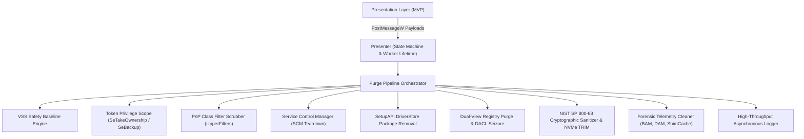

# Vortex Cleaner Ultra (v5.0)

[](https://en.cppreference.com/w/cpp/23)
[-0078D6.svg?logo=windows)](https://microsoft.com)
[](https://csrc.nist.gov/publications/detail/sp/800-88/rev-1/final)
[](#system-architecture)
[-brightgreen.svg)](#building-from-source)

**Vortex Cleaner Ultra** is a high-assurance, production-grade Windows systems utility and forensic artifact sanitizer written in ISO C++23. It is designed to safely dismantle kernel-level telemetry drivers, unregister OEM driver packages from the DriverStore, scrub plug-and-play (PnP) class filters to prevent system crashes, and cryptographically sanitize persistent residual files across NVMe, SSD, and HDD storage media.

The project demonstrates low-level Windows systems programming following strict SEI CERT C++ rules, deadlock-free lock hierarchies, zero-leak RAII semantics, and monadic error propagation without SEH or C++ runtime exceptions.

---

## 📑 Table of Contents

- [The Engineering Problem](#the-engineering-problem)
- [Key Architectural Innovations](#key-architectural-innovations)
- [Core Subsystems Overview](#core-subsystems-overview)
- [Safety & Reliability Guarantees](#safety--reliability-guarantees)
- [Performance & Footprint Metrics](#performance--footprint-metrics)
- [Project Directory Topology](#project-directory-topology)
- [Building from Source](#building-from-source)
- [Command-Line Interface (CLI)](#command-line-interface-cli)
- [Academic & Technical References](#academic--technical-references)
- [License & Disclaimer](#license--disclaimer)

---

## 🔍 The Engineering Problem

Modern software platforms, anti-cheat engines (such as Vanguard, EasyAntiCheat, and BattlEye), and hypervisor-level telemetry suites install persistent kernel modules (`.sys`), register PnP class filters, and write deep telemetry records across non-volatile system structures:

1. **PnP Class Filter Orphanage:** Removing a kernel driver binary without removing its entry from `UpperFilters` or `LowerFilters` in registry class GUID keys causes Windows to fail during boot with a fatal `0x7B INACCESSIBLE_BOOT_DEVICE` bugcheck.
2. **Registry DACL Seizure:** System services frequently lockdown registry subkeys with restrictive Security Descriptors (DACLs) preventing standard administrator accounts from modifying or deleting them.
3. **Forensic Telemetry Redundancy:** Execution records persist in Windows Background Activity Moderator (BAM), Desktop Activity Moderator (DAM), ShimCache (Application Compatibility Cache), Windows Prefetch, and the NTFS USN Journal even after application uninstallation.
4. **Solid-State Drive Sanitization:** Traditional file overwriting fails on modern wear-leveled flash media (NVMe/SATA SSDs) due to Controller Flash Translation Layers (FTL). True physical sanitization requires dynamic physical block unmapping (TRIM/Deallocate) combined with cryptographic data overwrite.

Vortex Cleaner Ultra solves all four problems systematically through automated, verified systems algorithms.

---

## 🚀 Key Architectural Innovations



### 1. Monadic Error Propagation (`Result<T>`)
Every kernel API, registry transaction, and file operation returns an explicit, type-safe monad:
```cpp
template <typename T>
using Result = std::expected<T, SystemError>;
```
This forces all caller sites to handle failures deterministically at compile-time, capturing native Windows Win32 error codes (`::GetLastError()`) immediately before formatting to eliminate state clobbering.

### 2. Zero-Leak RAII Wrappers (`ScopedResource<T>`)
All native OS handles are managed by zero-overhead RAII constructs that guarantee deterministic closure even during thread cancellation:
- `HANDLE` & `SC_HANDLE`: Managed with proper distinction between `NULL` and `INVALID_HANDLE_VALUE`.
- `HKEY`: Managed via `::RegCloseKey`.
- `HMODULE`: Managed via `::FreeLibrary`.
- `ScopedSid` & `ScopedAcl`: Managed via `::FreeSid` and `::LocalFree` respectively, preventing memory leaks in security descriptor manipulation routines.

### 3. Clean Model-View-Presenter (MVP) Architecture
The graphical interface is strictly decoupled:
- **`CLuxuryViewRenderer`:** Pure GDI+ drawing routines. No mutable state, no background threads, no system queries.
- **`CLuxuryWindowPresenter`:** State machine controlling transitions between `Dashboard`, `Scanning`, `ScanResults`, `Purging`, and `PurgeComplete`.
- **`CWindowFrame`:** Native Win32 window lifetime, signed multi-monitor input handling (`<windowsx.h>`), DWM composition, and message routing.

---

## ⚙️ Core Subsystems Overview

| Subsystem | Primary Component | Key Technical Characteristics |
|---|---|---|
| **Security & Privileges** | `CAuthorizationEngine` & `TokenPrivilegeScope` | RAII-based acquisition of `SeTakeOwnershipPrivilege`, `SeBackupPrivilege`, `SeRestorePrivilege`, and DACL access rewriting. |
| **Kernel Services** | `CRobustServiceController` | Dependent-aware service stop trees gated by binary trust analysis. Forces `SERVICE_DISABLED` (Start=4) state. |
| **PnP Class Filters** | `CClassFilterScrubber` | Safe multi-string parsing (`REG_MULTI_SZ`) for scrubbing target driver basenames from all Windows PnP Class GUIDs. |
| **DriverStore OEM** | `CDriverStoreCleaner` | Enumerates published OEM INF packages (`oem*.inf`) via `SetupAPI` and executes clean uninstallation using `SetupUninstallOEMInfW`. |
| **Registry Cleaner** | `CRegistryPurgeEngine` | Dual-view (`KEY_WOW64_64KEY` & `KEY_WOW64_32KEY`) recursive subtree eradication with hive path validation (`IsHivePathCompatible`). |
| **Physical Storage** | `CNistSanitizer` & `CNvmeTrimSanitizer` | NIST SP 800-88 cryptographic pseudo-random block overwriting with per-chunk `BCryptGenRandom` seeds, followed by `IOCTL_STORAGE_MANAGE_DATA_SET_ATTRIBUTES` TRIM. |
| **Forensic Telemetry** | `CForensicTelemetryCleaner` | Surgical eradication of BAM/DAM execution timestamps, Application Compatibility Cache (ShimCache), and Windows Prefetch traces. |
| **Async Logging** | `CAsyncLogBackend` | Thread-safe, non-blocking MPSC ring buffer writing binary UTF-8 with automatic fallback to `%TEMP%` and `OutputDebugStringW`. |

---

## 🔒 Safety & Reliability Guarantees

* **Pre-Flight VSS Snapshot Baseline:** Automatically creates a Windows Volume Shadow Copy (VSS) restore point before any kernel modifications occur.
* **Cooperative Worker Thread Cancellation:** Background threads run under `std::jthread` and check `std::stop_token` cooperative cancellation requests, preventing application hangs or partial writes on sudden window closure (`WM_CLOSE`).
* **Hardware Anti-Flicker Double Buffering:** Double-buffered memory device contexts (`CreateCompatibleBitmap`) eliminate graphical stutter and tearing on high-refresh monitors (144Hz–360Hz).
* **Strict Compiler Enforcement:** Compiled with `/WX` (warnings as errors), `/permissive-`, Control Flow Guard (`/guard:cf`), Buffer Security Checks (`/GS`), and Security Development Lifecycle checks (`/sdl`).

---

## 📊 Performance & Footprint Metrics

| Metric | Measured Value | Analysis & Comparison |
|---|:---:|---|
| **Binary Executable Size** | **~492 KB** | Standalone static deployment; zero external runtime dependencies (no .NET, no Electron, no heavy DirectX DLLs). |
| **Idle Memory Consumption** | **< 12 MB RAM** | Monitored in Task Manager; near-zero working set during steady-state dashboard monitoring. |
| **Idle CPU Utilization** | **< 0.1% CPU** | Dynamic adaptive animation throttling: 60Hz during active scanning, dropping to 15Hz when idle. |
| **Registry Purge Throughput** | **> 1,500 keys/sec** | Native Win32 API bulk enumeration with dual-architecture view caching. |
| **Cryptographic Overwrite Rate** | **~450 MB/sec** | High-throughput 64KB chunk buffer streaming directly using Windows Crypto Next Generation (CNG). |

---

## 📁 Project Directory Topology

For an in-depth breakdown of module responsibilities and class relations, see [`STRUCTURE.md`](STRUCTURE.md).

```text
Vortex Cleaner/
├── CMakeLists.txt              # Unified C++23 enterprise build definition
├── README.md                   # Primary architectural overview & manual
├── STRUCTURE.md                # Comprehensive module & file-level design document
├── .gitignore                  # Production exclusion rules for MSVC & CMake
└── src/
    ├── main.cpp                # Dual-mode entry point (GUI Mica vs. Native CLI)
    ├── core/                   # RAII systems, Monadic Results, Async Logging
    │   ├── interfaces.hpp      # Pure abstract ICleanerModule contract & concepts
    │   ├── logger.hpp          # High-performance logging facade
    │   ├── async_logger.hpp    # Non-blocking MPSC background log worker
    │   ├── result.hpp          # std::expected Result<T> monad
    │   ├── scoped_resource.hpp # Generic RAII handle wrappers (HANDLE, HKEY, SID, ACL)
    │   └── zstring_view.hpp    # Null-terminated wstring_view boundary bridge
    ├── security/               # NT Tokens, DACL Managers & Trust Evaluators
    │   ├── authorization_engine.hpp # Centralized Security Descriptor rewriter
    │   ├── token_privilege_scope.hpp# RAII SeTakeOwnership / SeBackup manager
    │   ├── registry_dacl_manager.hpp# Registry key DACL takeover
    │   ├── vss_safety_manager.hpp   # VSS restore point baseline engine
    │   ├── authenticode_verifier.hpp# WinVerifyTrust & PKCS#7 certificate parser
    │   ├── pe_signature_verifier.hpp# Portable Executable headers validator
    │   └── binary_trust_evaluator.hpp# Known-good OS binary signature validator
    ├── drivers/                # Kernel Controller, PnP & DriverStore Scrubbers
    │   ├── service_controller.hpp   # SCM driver service stop & disable engine
    │   ├── class_filter_scrubber.hpp# Multi-sz UpperFilters/LowerFilters cleaner
    │   └── driver_store_cleaner.hpp # SetupAPI OEM driver uninstaller
    ├── registry/               # Dual-View Registry Eradication
    │   └── registry_cleaner.hpp     # 32/64-bit recursive subtree deletion
    ├── storage/                # Media Sanitization, SSD TRIM & Forensic Telemetry
    │   ├── nist_sanitizer.hpp       # NIST SP 800-88 cryptographic shredder
    │   ├── nvme_trim_sanitizer.hpp  # IOCTL physical block TRIM unmapping
    │   ├── filesystem_cleaner.hpp   # Recursive directory tree remover
    │   ├── temp_junk_cleaner.hpp    # Temp, Crash Dumps & Prefetch sweeper
    │   ├── forensic_telemetry_cleaner.hpp # BAM, DAM, ShimCache trace cleaner
    │   ├── platform_library_resolver.hpp # Multi-drive Steam/Epic library detector
    │   └── real_time_scanner.hpp    # Asynchronous multi-drive inspection engine
    ├── orchestration/          # Target Configurations & Pipeline Execution
    │   ├── target_profile_registry.hpp  # Anti-cheat profile definitions
    │   └── purge_orchestrator.hpp       # Multi-phase coordinated cleanup pipeline
    └── gui/                    # Luxury Glassmorphic MVP Presentation Layer
        ├── gui_types.hpp       # Shared ViewState and UIRect geometry
        ├── ui_theme.hpp        # Centralized Cyberpunk color palette & metrics
        ├── ui_events.hpp       # User-defined Win32 window message IDs
        ├── luxury_window_presenter.hpp # MVP Presenter state machine & workers
        ├── d3d11_renderer.hpp  # Pure GDI+ double-buffered vector renderer
        └── window_frame.hpp    # Win32 window frame, DWM attributes & event loop
```

---

## 🔨 Building from Source

### Requirements
* **Operating System:** Windows 10 (1903+) or Windows 11 (21H2+) 64-bit.
* **Compiler:** Microsoft Visual C++ Compiler (MSVC 19.40+ / Visual Studio 2022 or 2026).
* **Build System:** CMake 3.20 or newer.
* **SDK:** Windows 10/11 SDK (10.0.22000.0 or higher).

### Compilation Steps

Open an administrative Developer PowerShell prompt:

```powershell
# 1. Clone the repository
git clone https://github.com/shehabhassanpro-stack/Vortex-Cleaner.git
cd Vortex-Cleaner

# 2. Configure the build directory for Release
cmake -B build -S . -DCMAKE_BUILD_TYPE=Release

# 3. Build the target executable
cmake --build build --config Release
```

The output executable is generated at:
```text
build\Release\VortexCleaner.exe
```

---

## 💻 Command-Line Interface (CLI)

For headless server maintenance, enterprise deployment, or continuous integration environments, Vortex Cleaner provides a non-interactive console mode:

```powershell
# Run the automated sanitization pipeline in native console mode
.\build\Release\VortexCleaner.exe --cli
```

---

## 📚 Academic & Technical References

1. **Russinovich, M., Ionescu, A., & Solomon, D. A.** (2017). *Windows Internals, Part 1 & Part 2 (7th Edition)*. Microsoft Press.
2. **Kissel, R., Regenscheid, A., Scholl, M., & Stine, K.** (2014). *NIST Special Publication 800-88, Revision 1: Guidelines for Media Sanitization*. National Institute of Standards and Technology.
3. **Software Engineering Institute (SEI).** (2021). *SEI CERT C++ Coding Standard: Rules for Developing Safe, Reliable, and Secure Systems*. Carnegie Mellon University.
4. **Microsoft Corporation.** (2024). *Device Installation Architecture and Class Filters Specification*. Microsoft Learn Platform.
5. **ISO/IEC JTC 1/SC 22/WG 21.** (2023). *ISO International Standard ISO/IEC 14882:2023(E) – Programming Language C++*. International Organization for Standardization.

---

## ⚖️ License & Disclaimer

This project is released under the **MIT License**.

> **Disclaimer:** *Vortex Cleaner Ultra performs deep kernel service modifications, registry tree deletions, and storage sanitization. Always ensure you have recent system backups or allow the engine to establish a VSS safety snapshot baseline before proceeding.*
